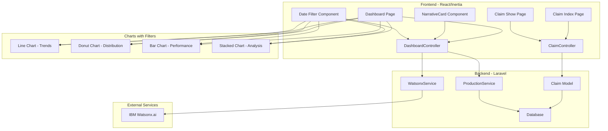
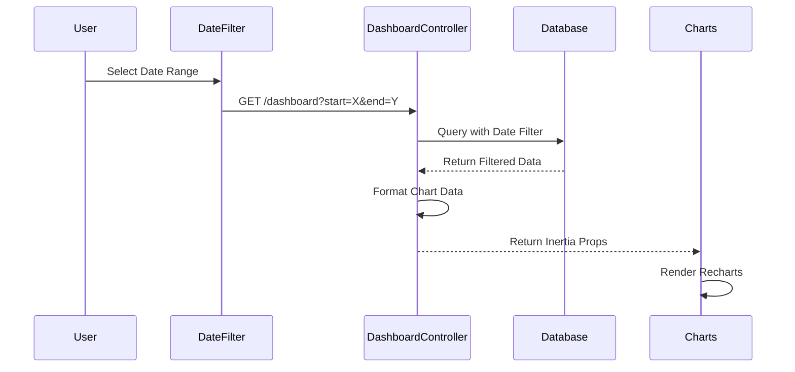
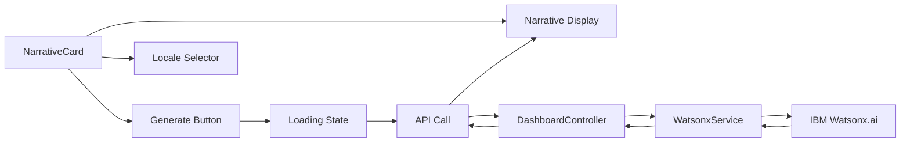

# Claim Pages & Enhanced Dashboard Implementation Plan

## Overview
This plan outlines the implementation of:
1. **Claim Management Pages**: Index and Show pages with action buttons for claim management
2. **Enhanced Dashboard**: 6 KPI cards, 4 Recharts charts with date filters, and AI-generated narrative card (manual generation)

## User Preferences Applied
- ✅ Using **Recharts** library for all charts
- ✅ Claim Show page includes **action buttons** (approve, reject, mark as paid)
- ✅ Narrative generation is **manual** (button click only, not auto-generated)
- ✅ Charts use **all-time data with date range filters**

## Architecture

### System Components



## 1. Claim Pages Implementation

### 1.1 Claim Index Page
**File**: `resources/js/pages/claim/index.tsx`

**Features**:
- Search functionality (claim number, policy number, holder/insured name)
- Filter by status (pending, approved, rejected, paid)
- Filter by claim type
- Paginated table display
- Row click navigation to detail page
- Status badges with color coding
- Quick action buttons in table rows

**Data Structure**:
```typescript
interface ClaimData {
    id: string;
    claim_number: string;
    policy: {
        policy_no: string;
        case_code: string;
        holder: { name: string };
        insured: { name: string };
    };
    claim_type: string;
    claim_date: string;
    claim_amount: number;
    approved_amount?: number;
    status: 'pending' | 'approved' | 'rejected' | 'paid';
    user: { name: string };
}
```

**UI Components**:
- TablePage layout wrapper
- Search input with debounce (300ms)
- Status filter dropdown
- Claim type filter dropdown
- Responsive table with sortable columns
- Status badges with icons
- Pagination component

### 1.2 Claim Show Page
**File**: `resources/js/pages/claim/show.tsx`

**Features**:
- Comprehensive claim details display
- Policy information section
- Claim timeline visualization
- Document attachments display
- Status history
- **Action buttons** (approve, reject, mark as paid) with authorization checks

**Action Buttons Implementation**:
```typescript
interface ClaimActions {
    canApprove: boolean;
    canReject: boolean;
    canMarkPaid: boolean;
}

// Action handlers
const handleApprove = (approvedAmount: number) => {
    router.put(`/sales/claim/${claim.id}/approve`, {
        approved_amount: approvedAmount,
        approved_at: new Date().toISOString()
    });
};

const handleReject = (reason: string) => {
    router.put(`/sales/claim/${claim.id}/reject`, {
        rejection_reason: reason
    });
};

const handleMarkPaid = () => {
    router.put(`/sales/claim/${claim.id}/mark-paid`, {
        paid_at: new Date().toISOString()
    });
};
```

**Sections**:
1. **Claim Header**: Claim number, status badge, dates, action buttons
2. **Policy Information**: Policy details, holder, insured, agent
3. **Claim Details**: Type, amount, incident date, description
4. **Financial Information**: Claimed amount, approved amount, payment status
5. **Documents**: Attached files from policy
6. **Timeline**: Status changes and actions with timestamps
7. **Action Panel**: Approve/Reject/Mark Paid buttons with modals

**Required Backend Routes**:
```php
Route::put('claim/{claim}/approve', [ClaimController::class, 'approve']);
Route::put('claim/{claim}/reject', [ClaimController::class, 'reject']);
Route::put('claim/{claim}/mark-paid', [ClaimController::class, 'markPaid']);
```

## 2. Dashboard Enhancement

### 2.1 KPI Cards (Already Implemented)
The dashboard already has 6 KPI cards:
1. New Policies This Month
2. Premium Collected
3. MDRT-Tracking Agents
4. Active Claims
5. Expiring Policies (30 days)
6. Birthdays This Week

### 2.2 Date Filter Component

**Features**:
- Date range picker (start date, end date)
- Quick select buttons (Last 7 days, Last 30 days, Last 90 days, This Year, All Time)
- Apply button to refresh charts
- Reset button to clear filters

**Implementation**:
```typescript
interface DateFilterProps {
    onFilterChange: (startDate: string | null, endDate: string | null) => void;
}

const DateFilter: React.FC<DateFilterProps> = ({ onFilterChange }) => {
    const [startDate, setStartDate] = useState<string | null>(null);
    const [endDate, setEndDate] = useState<string | null>(null);
    
    const quickFilters = [
        { label: 'Last 7 Days', days: 7 },
        { label: 'Last 30 Days', days: 30 },
        { label: 'Last 90 Days', days: 90 },
        { label: 'This Year', year: true },
        { label: 'All Time', all: true }
    ];
    
    // Implementation details...
};
```

### 2.3 Chart Implementation with Recharts

#### Chart Data Flow


#### 2.3.1 Line Chart - Policy & Premium Trends
**Purpose**: Show policy creation and premium trends over time

**Data Structure**:
```php
[
    'trends_data' => [
        ['date' => '2025-01', 'policies' => 45, 'premium' => 125000000],
        ['date' => '2025-02', 'policies' => 52, 'premium' => 145000000],
        // ... filtered by date range
    ]
]
```

**Recharts Implementation**:
```typescript
import { LineChart, Line, XAxis, YAxis, CartesianGrid, Tooltip, Legend, ResponsiveContainer } from 'recharts';

<ResponsiveContainer width="100%" height={300}>
    <LineChart data={trendsData}>
        <CartesianGrid strokeDasharray="3 3" />
        <XAxis dataKey="date" />
        <YAxis yAxisId="left" />
        <YAxis yAxisId="right" orientation="right" />
        <Tooltip />
        <Legend />
        <Line yAxisId="left" type="monotone" dataKey="policies" stroke="#8884d8" name="Policies" />
        <Line yAxisId="right" type="monotone" dataKey="premium" stroke="#82ca9d" name="Premium" />
    </LineChart>
</ResponsiveContainer>
```

#### 2.3.2 Donut Chart - Claim Type Distribution
**Purpose**: Visualize distribution of claims by type

**Data Structure**:
```php
[
    'claim_distribution' => [
        ['name' => 'Death', 'value' => 15, 'amount' => 500000000],
        ['name' => 'Maturity', 'value' => 25, 'amount' => 750000000],
        ['name' => 'Surrender', 'value' => 10, 'amount' => 200000000],
        ['name' => 'Disability', 'value' => 5, 'amount' => 150000000],
    ]
]
```

**Recharts Implementation**:
```typescript
import { PieChart, Pie, Cell, Tooltip, Legend, ResponsiveContainer } from 'recharts';

const COLORS = ['#0088FE', '#00C49F', '#FFBB28', '#FF8042', '#8884D8'];

<ResponsiveContainer width="100%" height={300}>
    <PieChart>
        <Pie
            data={claimDistribution}
            cx="50%"
            cy="50%"
            innerRadius={60}
            outerRadius={80}
            fill="#8884d8"
            dataKey="value"
            label
        >
            {claimDistribution.map((entry, index) => (
                <Cell key={`cell-${index}`} fill={COLORS[index % COLORS.length]} />
            ))}
        </Pie>
        <Tooltip />
        <Legend />
    </PieChart>
</ResponsiveContainer>
```

#### 2.3.3 Bar Chart - Top Agents Performance
**Purpose**: Show top agents by premium collected (filtered by date range)

**Data Structure**:
```php
[
    'agent_performance' => [
        ['agent' => 'Agent A', 'premium' => 250000000, 'policies' => 15],
        ['agent' => 'Agent B', 'premium' => 220000000, 'policies' => 12],
        // ... top 10 agents in date range
    ]
]
```

**Recharts Implementation**:
```typescript
import { BarChart, Bar, XAxis, YAxis, CartesianGrid, Tooltip, Legend, ResponsiveContainer } from 'recharts';

<ResponsiveContainer width="100%" height={300}>
    <BarChart data={agentPerformance}>
        <CartesianGrid strokeDasharray="3 3" />
        <XAxis dataKey="agent" />
        <YAxis />
        <Tooltip />
        <Legend />
        <Bar dataKey="premium" fill="#8884d8" name="Premium" />
    </BarChart>
</ResponsiveContainer>
```

#### 2.3.4 Stacked Bar Chart - Premium Analysis by Product
**Purpose**: Show premium breakdown by product type over time periods

**Data Structure**:
```php
[
    'premium_by_product' => [
        [
            'period' => 'Jan 2025',
            'Product A' => 150000000,
            'Product B' => 120000000,
            'Product C' => 80000000,
        ],
        // ... grouped by month/quarter based on date range
    ],
    'products' => ['Product A', 'Product B', 'Product C'] // for dynamic stacking
]
```

**Recharts Implementation**:
```typescript
import { BarChart, Bar, XAxis, YAxis, CartesianGrid, Tooltip, Legend, ResponsiveContainer } from 'recharts';

<ResponsiveContainer width="100%" height={300}>
    <BarChart data={premiumByProduct}>
        <CartesianGrid strokeDasharray="3 3" />
        <XAxis dataKey="period" />
        <YAxis />
        <Tooltip />
        <Legend />
        {products.map((product, index) => (
            <Bar key={product} dataKey={product} stackId="a" fill={COLORS[index]} />
        ))}
    </BarChart>
</ResponsiveContainer>
```

### 2.4 AI Narrative Card (Manual Generation)

#### Architecture


#### Features
1. **Initial State**: Empty or placeholder text with "Generate Insights" button
2. **Generate Button**: Triggers narrative generation
3. **Locale Selector**: Dropdown for language selection (en, id)
4. **Loading State**: Shows spinner and "Generating insights..." message
5. **Narrative Display**: Shows AI-generated text with timestamp
6. **Regenerate Button**: Appears after generation, allows regeneration
7. **Error Handling**: Displays error messages gracefully

#### API Endpoint
**Route**: `POST /dashboard/generate-narrative`

**Request**:
```json
{
    "locale": "id",
    "start_date": "2025-01-01",
    "end_date": "2025-12-31"
}
```

**Response**:
```json
{
    "narrative": "Berdasarkan data periode yang dipilih, terdapat peningkatan signifikan...",
    "generated_at": "2026-05-17T02:00:00Z",
    "stats_summary": {
        "policies": 150,
        "premium": 5000000000,
        "claims": 25
    }
}
```

#### Implementation Details

**Controller Method**:
```php
public function generateNarrative(Request $request)
{
    $validated = $request->validate([
        'locale' => 'required|string|in:en,id',
        'start_date' => 'nullable|date',
        'end_date' => 'nullable|date|after_or_equal:start_date',
    ]);
    
    $locale = $validated['locale'];
    $startDate = $validated['start_date'] ?? null;
    $endDate = $validated['end_date'] ?? null;
    
    // Gather statistics with date filter
    $stats = [
        'period' => $startDate && $endDate 
            ? "from {$startDate} to {$endDate}" 
            : 'all time',
        'new_policies' => $this->getNewPoliciesKPI($startDate, $endDate),
        'premium_collected' => $this->getPremiumCollectedKPI($startDate, $endDate),
        'active_claims' => $this->getActiveClaimsKPI($startDate, $endDate),
        'top_agents' => $this->getTopAgents($startDate, $endDate, 5),
        'claim_types' => $this->getClaimDistribution($startDate, $endDate),
    ];
    
    try {
        // Generate narrative using WatsonxService
        $narrative = app(WatsonxService::class)
            ->generateNarrative($stats, $locale);
        
        return response()->json([
            'narrative' => $narrative,
            'generated_at' => now()->toIso8601String(),
            'stats_summary' => [
                'policies' => $stats['new_policies']['this_period'] ?? 0,
                'premium' => $stats['premium_collected']['amount'] ?? 0,
                'claims' => $stats['active_claims']['count'] ?? 0,
            ]
        ]);
    } catch (\Exception $e) {
        return response()->json([
            'error' => 'Failed to generate narrative',
            'message' => $e->getMessage()
        ], 500);
    }
}
```

**React Component Structure**:
```typescript
interface NarrativeCardProps {
    availableLocales: Array<{code: string, name: string}>;
    dateRange?: {start: string | null, end: string | null};
}

const NarrativeCard: React.FC<NarrativeCardProps> = ({
    availableLocales,
    dateRange
}) => {
    const [narrative, setNarrative] = useState<string | null>(null);
    const [locale, setLocale] = useState('en');
    const [loading, setLoading] = useState(false);
    const [error, setError] = useState<string | null>(null);
    const [generatedAt, setGeneratedAt] = useState<string | null>(null);
    
    const handleGenerate = async () => {
        setLoading(true);
        setError(null);
        
        try {
            const response = await fetch('/dashboard/generate-narrative', {
                method: 'POST',
                headers: {
                    'Content-Type': 'application/json',
                    'X-CSRF-TOKEN': document.querySelector('meta[name="csrf-token"]')?.getAttribute('content') || ''
                },
                body: JSON.stringify({
                    locale,
                    start_date: dateRange?.start,
                    end_date: dateRange?.end
                })
            });
            
            if (!response.ok) throw new Error('Failed to generate narrative');
            
            const data = await response.json();
            setNarrative(data.narrative);
            setGeneratedAt(data.generated_at);
        } catch (err) {
            setError(err.message);
        } finally {
            setLoading(false);
        }
    };
    
    return (
        <div className="card">
            <div className="card-header d-flex justify-content-between align-items-center">
                <h4 className="card-title mb-0">AI-Generated Insights</h4>
                <div className="d-flex gap-2 align-items-center">
                    <select 
                        className="form-select form-select-sm" 
                        value={locale}
                        onChange={(e) => setLocale(e.target.value)}
                        disabled={loading}
                    >
                        {availableLocales.map(loc => (
                            <option key={loc.code} value={loc.code}>
                                {loc.name}
                            </option>
                        ))}
                    </select>
                    <button 
                        className="btn btn-sm btn-primary"
                        onClick={handleGenerate}
                        disabled={loading}
                    >
                        <i className={`la ${loading ? 'la-spinner la-spin' : 'la-magic'} me-1`}></i>
                        {narrative ? 'Regenerate' : 'Generate'}
                    </button>
                </div>
            </div>
            <div className="card-body">
                {loading && (
                    <div className="text-center py-4">
                        <div className="spinner-border text-primary" role="status">
                            <span className="visually-hidden">Generating...</span>
                        </div>
                        <p className="mt-2 text-muted">Generating insights...</p>
                    </div>
                )}
                
                {error && (
                    <div className="alert alert-danger">
                        <i className="la la-exclamation-triangle me-2"></i>
                        {error}
                    </div>
                )}
                
                {!loading && !error && narrative && (
                    <div>
                        <p className="mb-3" style={{ whiteSpace: 'pre-wrap' }}>
                            {narrative}
                        </p>
                        {generatedAt && (
                            <small className="text-muted">
                                <i className="la la-clock me-1"></i>
                                Generated: {new Date(generatedAt).toLocaleString()}
                            </small>
                        )}
                    </div>
                )}
                
                {!loading && !error && !narrative && (
                    <div className="text-center py-4 text-muted">
                        <i className="la la-lightbulb" style={{ fontSize: '48px' }}></i>
                        <p className="mt-2">Click "Generate" to create AI-powered insights</p>
                    </div>
                )}
            </div>
        </div>
    );
};
```

## 3. Implementation Steps

### Phase 1: Claim Pages (Priority 1)
1. Create `resources/js/pages/claim/index.tsx` with search and filters
2. Create `resources/js/pages/claim/show.tsx` with action buttons
3. Add backend routes for claim actions (approve, reject, mark-paid)
4. Implement action methods in ClaimController
5. Add TypeScript interfaces for claim data
6. Add status badge styling and icons
7. Test navigation and data display
8. Test action buttons and authorization

### Phase 2: Dashboard Charts (Priority 2)
1. Install Recharts: `npm install recharts`
2. Create DateFilter component
3. Add chart data methods to DashboardController:
   - `getTrendsData($startDate, $endDate)`
   - `getClaimDistribution($startDate, $endDate)`
   - `getAgentPerformance($startDate, $endDate)`
   - `getPremiumByProduct($startDate, $endDate)`
4. Update dashboard.tsx with chart components
5. Implement date filtering logic
6. Style charts to match existing design
7. Test with various date ranges

### Phase 3: AI Narrative (Priority 3)
1. Add narrative generation route
2. Implement `generateNarrative()` in DashboardController
3. Create NarrativeCard component
4. Add locale selector with i18n support
5. Implement loading and error states
6. Test with different locales and date ranges
7. Add rate limiting to prevent abuse

### Phase 4: Integration & Testing (Priority 4)
1. Integrate all components into dashboard layout
2. Test responsive design on mobile/tablet
3. Test data refresh and real-time updates
4. Performance optimization (caching, lazy loading)
5. Error handling and edge cases
6. Cross-browser testing
7. Accessibility testing

## 4. Technical Specifications

### Dependencies
- **Recharts**: ^2.x (to be installed)
- **React Bootstrap**: Already installed
- **Inertia.js**: Already configured
- **WatsonxService**: Already implemented

### File Structure
```
resources/js/
├── pages/
│   ├── claim/
│   │   ├── index.tsx          # Claim list page
│   │   └── show.tsx           # Claim detail page with actions
│   └── dashboard.tsx          # Enhanced dashboard
├── components/
│   ├── DateFilter.tsx         # Date range filter
│   ├── charts/
│   │   ├── TrendsChart.tsx    # Line chart
│   │   ├── DistributionChart.tsx  # Donut chart
│   │   ├── PerformanceChart.tsx   # Bar chart
│   │   └── AnalysisChart.tsx      # Stacked chart
│   └── NarrativeCard.tsx      # AI narrative component
└── types/
    └── claim.d.ts             # Claim type definitions

app/Http/Controllers/
├── ClaimController.php        # Add action methods
└── DashboardController.php    # Add chart data & narrative methods
```

### API Endpoints
- `GET /sales/claim` - List claims (existing)
- `GET /sales/claim/{claim}` - Show claim (existing)
- `PUT /sales/claim/{claim}/approve` - Approve claim (new)
- `PUT /sales/claim/{claim}/reject` - Reject claim (new)
- `PUT /sales/claim/{claim}/mark-paid` - Mark as paid (new)
- `GET /dashboard?start_date=X&end_date=Y` - Dashboard with filters (enhanced)
- `POST /dashboard/generate-narrative` - Generate AI narrative (new)

### Database Queries Optimization
- Use eager loading for relationships
- Add indexes on date columns for filtering
- Cache chart data for 5 minutes with date-based keys
- Use query builder for complex aggregations
- Implement pagination for large datasets

## 5. UI/UX Considerations

### Color Scheme
- **Pending**: `#ffc107` (Yellow/Warning)
- **Approved**: `#17a2b8` (Blue/Info)
- **Rejected**: `#dc3545` (Red/Danger)
- **Paid**: `#28a745` (Green/Success)

### Chart Colors (Recharts)
```typescript
const CHART_COLORS = [
    '#0088FE', // Blue
    '#00C49F', // Teal
    '#FFBB28', // Yellow
    '#FF8042', // Orange
    '#8884D8', // Purple
    '#82ca9d', // Green
];
```

### Responsive Design
- Charts stack vertically on mobile (<768px)
- Tables scroll horizontally on small screens
- KPI cards adapt to grid layout (1 col on mobile, 2 on tablet, 3 on desktop)
- Narrative card full-width on all devices
- Date filter collapses to dropdown on mobile

### Accessibility
- ARIA labels for all charts
- Keyboard navigation support for filters
- Screen reader friendly status badges
- High contrast mode support
- Focus indicators on interactive elements

## 6. Testing Checklist

### Claim Pages
- [ ] Search functionality works correctly
- [ ] Filters apply properly (status, type)
- [ ] Pagination works
- [ ] Row click navigation to detail page
- [ ] Detail page displays all information
- [ ] Approve button works with amount input
- [ ] Reject button works with reason input
- [ ] Mark Paid button works
- [ ] Authorization checks prevent unauthorized actions
- [ ] Responsive on mobile devices

### Dashboard Charts
- [ ] All 4 charts render correctly
- [ ] Date filter applies to all charts
- [ ] Quick filter buttons work
- [ ] Data updates on filter change
- [ ] Tooltips show accurate information
- [ ] Charts are responsive
- [ ] No performance issues with large datasets
- [ ] Empty state displays when no data

### AI Narrative
- [ ] Generate button triggers API call
- [ ] Loading state displays during generation
- [ ] Narrative displays after generation
- [ ] Locale switching works
- [ ] Regenerate button functions
- [ ] Error handling works
- [ ] Text is readable and formatted
- [ ] Timestamp displays correctly
- [ ] Date range affects narrative content

## 7. Performance Targets

- **Page Load**: < 2 seconds
- **Chart Render**: < 500ms
- **Narrative Generation**: < 10 seconds
- **Search Response**: < 300ms
- **Filter Application**: < 500ms

## 8. Security Considerations

- Validate all user inputs (dates, amounts, reasons)
- Sanitize narrative output to prevent XSS
- Rate limit narrative generation API (max 10 requests per minute per user)
- Implement proper authorization checks for claim actions
- Protect against SQL injection in date filters
- CSRF protection on all POST/PUT requests
- Audit log for claim status changes

## 9. Error Handling

### Frontend
- Display user-friendly error messages
- Retry mechanism for failed API calls
- Fallback UI for chart rendering errors
- Validation errors on form inputs

### Backend
- Try-catch blocks around external API calls
- Graceful degradation if WatsonxService fails
- Log all errors for debugging
- Return appropriate HTTP status codes

## Next Steps

The plan is now ready for implementation. We'll proceed in Code mode following the phases outlined above, starting with:

1. **Phase 1**: Claim Pages (Index and Show with action buttons)
2. **Phase 2**: Dashboard Charts with Recharts and date filters
3. **Phase 3**: AI Narrative Card with manual generation
4. **Phase 4**: Integration and testing

Ready to switch to Code mode for implementation!