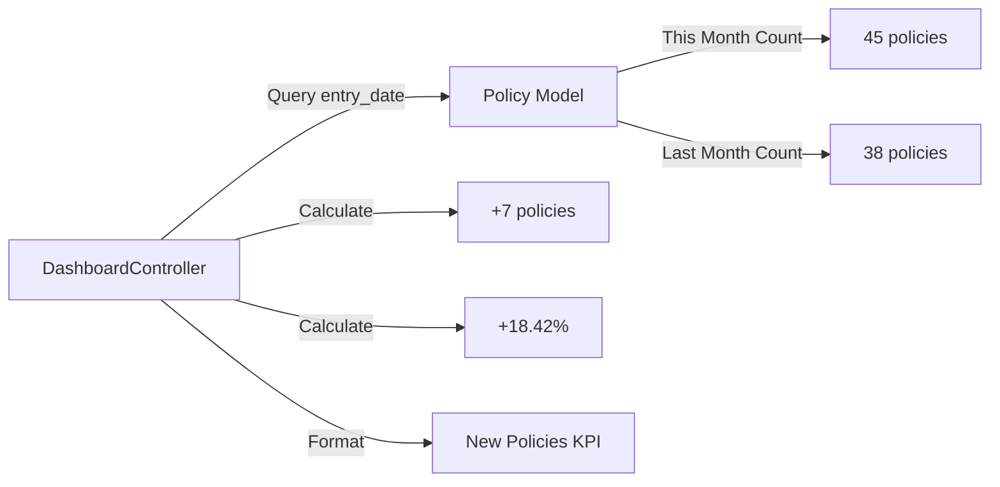
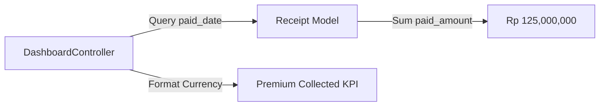
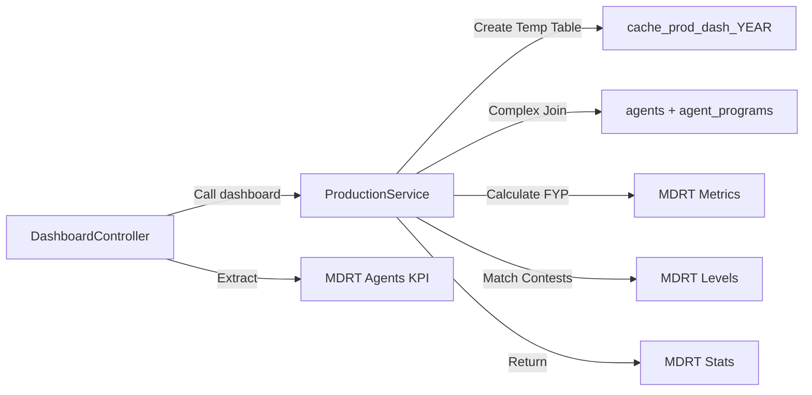
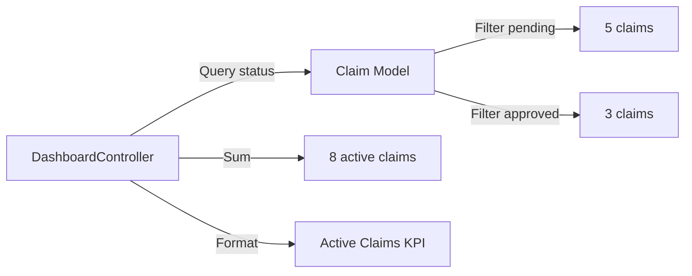
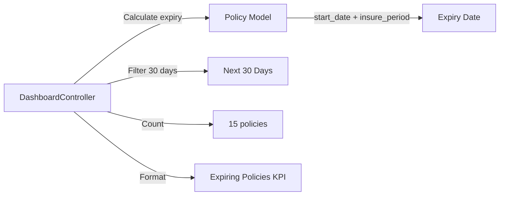
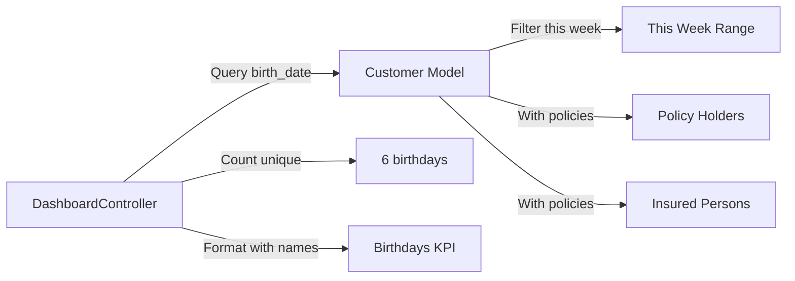
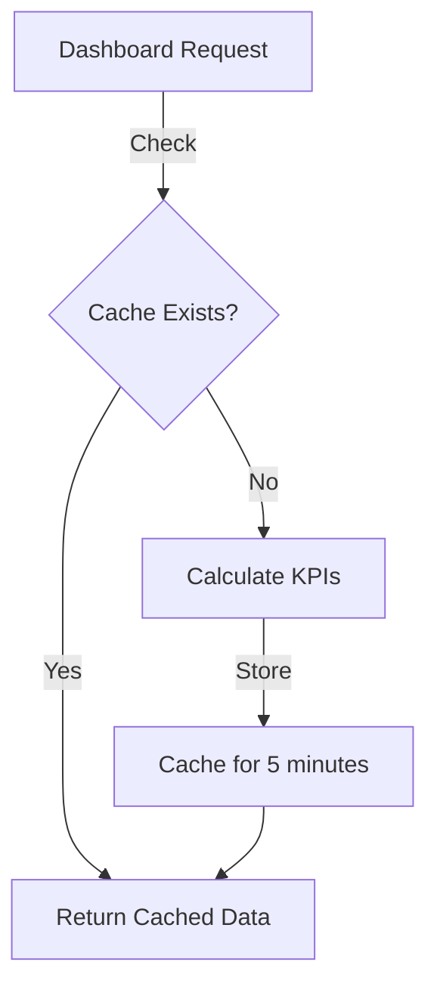
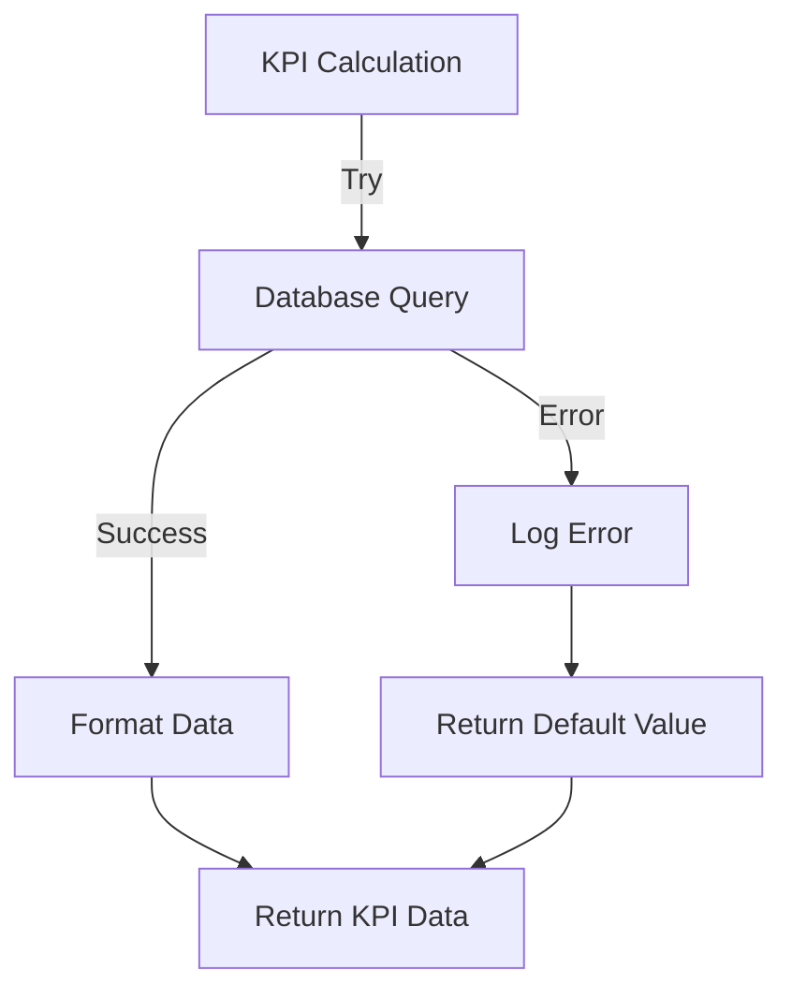

# Dashboard Architecture

## System Flow Diagram

```mermaid
graph TB
    User[User Browser] -->|HTTP Request| Route[/dashboard Route]
    Route -->|Calls| DC[DashboardController]
    
    DC -->|Injects| PS[ProductionService]
    DC -->|Queries| PM[Policy Model]
    DC -->|Queries| CM[Claim Model]
    DC -->|Queries| CUM[Customer Model]
    DC -->|Queries| RM[Receipt Model]
    
    PM -->|Reads| CasesDB[(cases table)]
    CM -->|Reads| ClaimsDB[(claims table)]
    CUM -->|Reads| CustomersDB[(customers table)]
    RM -->|Reads| ReceiptsDB[(receipts table)]
    
    PS -->|Complex Query| ProdCache[Production Cache Table]
    PS -->|Reads| AgentsDB[(agents table)]
    PS -->|Reads| ContestsDB[(contests table)]
    
    DC -->|Aggregates| KPIData[KPI Data Array]
    DC -->|Returns| Inertia[Inertia Response]
    Inertia -->|Renders| Frontend[dashboard.tsx]
    Frontend -->|Displays| User
```

## Data Flow for Each KPI

### 1. New Policies KPI


### 2. Premium Collected KPI


### 3. MDRT Agents KPI


### 4. Active Claims KPI


### 5. Expiring Policies KPI


### 6. Birthdays This Week KPI


## Component Structure

### Backend Components
```
app/
├── Http/
│   └── Controllers/
│       └── DashboardController.php (NEW)
│           ├── index()
│           ├── getNewPoliciesKPI()
│           ├── getPremiumCollectedKPI()
│           ├── getMdrtAgentsKPI()
│           ├── getActiveClaimsKPI()
│           ├── getExpiringPoliciesKPI()
│           └── getBirthdaysKPI()
├── Models/
│   ├── Policy.php (existing)
│   ├── Claim.php (existing)
│   ├── Customer.php (UPDATE - add relationships)
│   └── Receipt.php (existing)
└── Services/
    └── ProductionService.php (existing - reuse)
```

### Frontend Components
```
resources/js/
├── pages/
│   └── dashboard.tsx (UPDATE)
│       ├── KPI Cards Section (NEW)
│       │   ├── NewPoliciesCard
│       │   ├── PremiumCollectedCard
│       │   ├── MdrtAgentsCard
│       │   ├── ActiveClaimsCard
│       │   ├── ExpiringPoliciesCard
│       │   └── BirthdaysCard
│       └── Tables Section (existing)
│           ├── Empire Club Table
│           └── MDRT Table
└── actions/
    └── App/Http/Controllers/
        └── DashboardController.ts (NEW)
```

## Database Schema Reference

### Key Tables and Fields

**cases (policies)**
- `id`, `entry_date`, `start_date`, `insure_period`, `premium`
- `holder_id` → customers.id
- `insured_id` → customers.id

**claims**
- `id`, `policy_id`, `status`, `claim_date`, `claim_amount`
- Status values: 'pending', 'approved', 'rejected', 'paid'

**customers**
- `id`, `name`, `birth_date`, `email`, `mobile`

**receipts**
- `id`, `case_id`, `paid_date`, `paid_amount`, `premium`

**agents**
- `id`, `official_number`, `name`, `status`

**agent_programs**
- `agent_id`, `position`, `agent_leader_id`

**contests**
- `type` ('empire', 'mdrt'), `level`, `minimum_premium`, `reward`

## Performance Optimization Strategy

### Caching Strategy


### Query Optimization
1. **Indexes Required**:
   - `cases.entry_date`
   - `receipts.paid_date`
   - `claims.status`
   - `customers.birth_date`

2. **Eager Loading**:
   - Load customer relationships with policies
   - Preload agent data for MDRT calculations

3. **Query Batching**:
   - Combine similar date-range queries
   - Use single query for multiple counts where possible

## Error Handling



## Security Considerations

1. **Authorization**: Ensure user is authenticated
2. **Data Access**: Only show data user has permission to view
3. **SQL Injection**: Use parameterized queries (Laravel ORM handles this)
4. **Rate Limiting**: Consider caching to prevent excessive queries

## Testing Strategy

### Unit Tests
- Test each KPI calculation method independently
- Mock database responses
- Verify edge cases (zero values, null data)

### Integration Tests
- Test full dashboard response
- Verify data accuracy against database
- Test with various date ranges

### Performance Tests
- Measure query execution time
- Test with large datasets
- Verify caching effectiveness