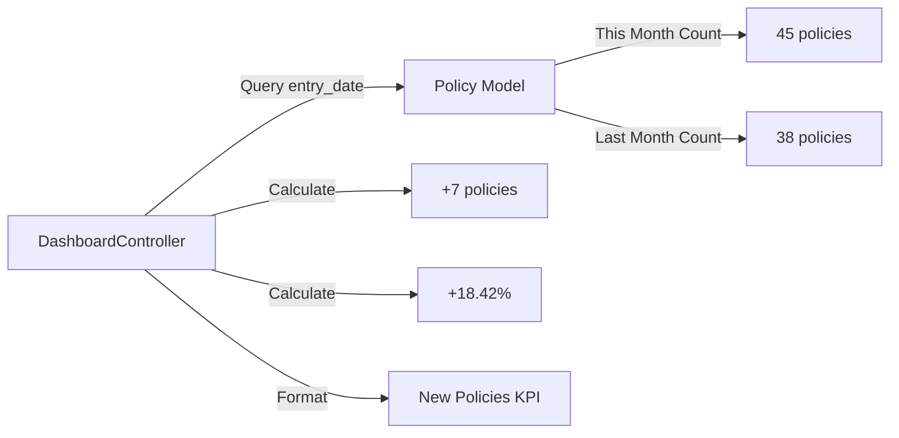
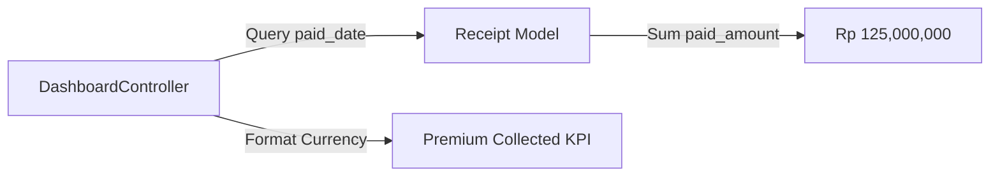
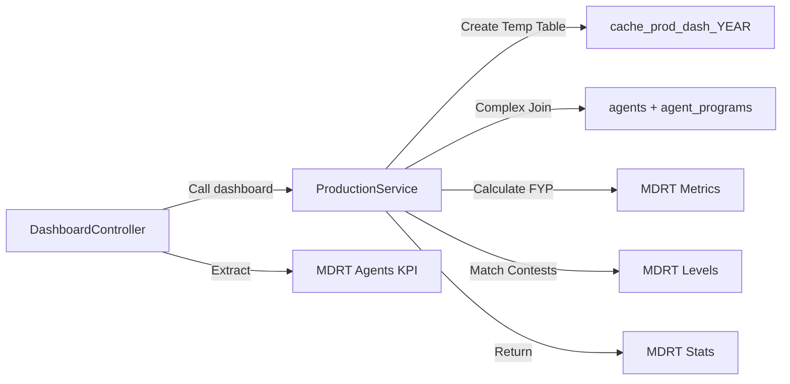
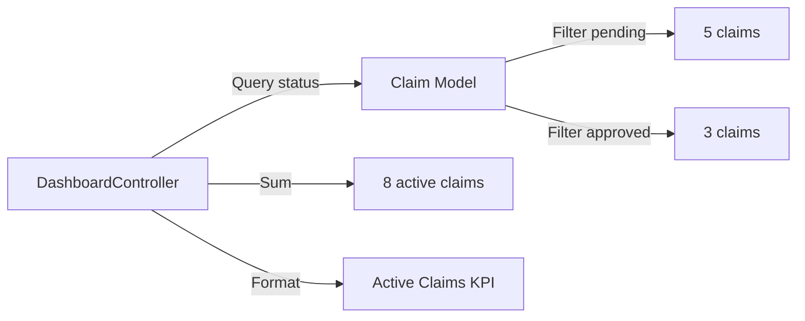
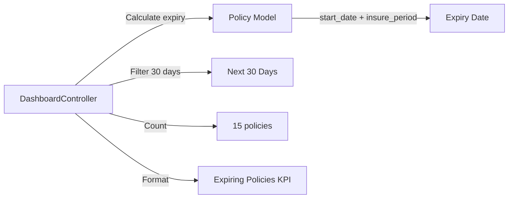
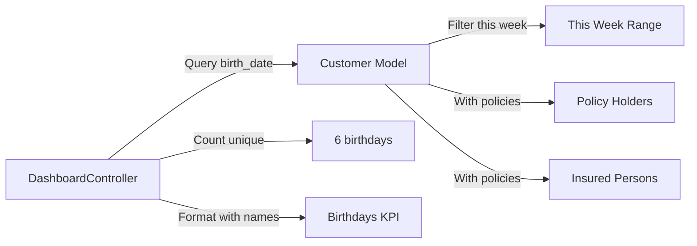
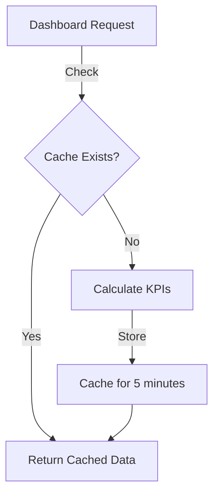
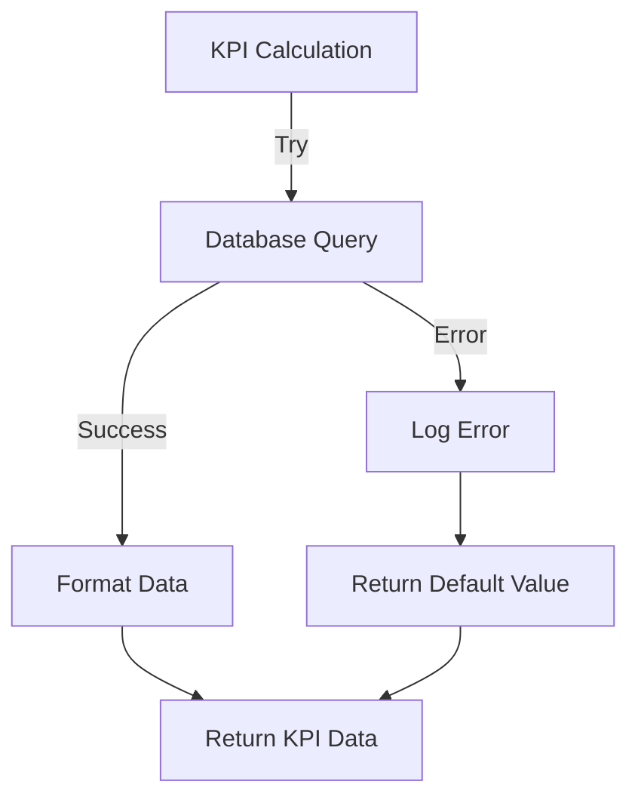

**User:**

<task>
Using Policy, Claim, Nasabah, and Kwitansi models, build DashboardController returning KPI stats for: new policies this month vs last, premium collected, MDRT-tracking agents, active claims, expiring policies in 30 days, birthdays this week
</task>
<environment_details>
# VSCode Visible Files
app/Http/Controllers/ClaimController.php

# VSCode Open Tabs
database/migrations/2026_05_17_012600_create_claims_table.php,app/Observers/ClaimObserver.php,app/Providers/AppServiceProvider.php,app/Http/Controllers/ClaimController.php,routes/web.php

# Current Time
Current time in ISO 8601 UTC format: 2026-05-17T01:31:50.414Z
User time zone: Asia/Jakarta, UTC+7:00

# Current Cost
$0.00

# Review Exclusions
The following file patterns are excluded from code reviews:
- .vscode/**

# Current Mode
<slug>plan</slug>
<name>📝 Plan</name>


# Current Workspace Directory (/Users/carlsson/Documents/InsurancePortal) Files
.editorconfig
.env.example
.gitattributes
.gitignore
.nvmrc
.prettierignore
.prettierrc
artisan
composer.json
eslint.config.js
package-lock.json
package.json
README.md
.github/
app/
bootstrap/
config/
database/
public/
public/.htaccess
public/apple-touch-icon.png
public/favicon.ico
public/index.js
public/index.php
public/logo192.png
public/logo512.png
public/manifest.json
public/robots.txt
public/images/1.jpg
public/images/add.svg
public/images/favicon.png
public/images/logo-full.png
public/images/logo-text-white.png
public/images/logo-text.png
public/images/logo-white.png
public/images/logo.png
public/images/search.svg
public/images/avatar/1.jpg
public/images/avatar/1.png
public/images/avatar/2.jpg
public/images/avatar/2.png
public/images/avatar/3.png
public/images/avatar/4.png
public/images/avatar/5.png
public/images/avatar/8.jpg
public/images/card/1.png
public/images/card/2.png
public/images/profile/1.jpg
public/images/profile/1.png
public/images/profile/2.jpg
public/images/profile/3.jpg
public/images/profile/4.jpg
public/images/profile/5.jpg
public/images/profile/6.jpg
public/images/profile/7.jpg
public/images/profile/8.jpg
public/images/profile/9.jpg
public/images/profile/cover.jpg
public/images/profile/pic1.jpg
public/images/profile/profile.png
public/images/svg/clip.svg
public/images/svg/close_menu.svg
public/images/svg/cog.svg
public/images/svg/edit_profile.svg
public/images/svg/search.svg
public/images/svg/ui_element.svg
public/images/tab/1.jpg
public/images/tab/2.jpg
public/images/tab/3.jpg
public/images/tab/4.jpg
public/images/tab/5.jpg
public/images/tab/6.jpg
public/images/tab/7.jpg
public/images/tab/8.jpg
public/images/tab/9.jpg
public/images/tab/10.jpg
public/images/tab/11.jpg
public/images/tab/12.jpg
public/images/tab/13.jpg
public/images/tab/14.jpg
public/images/tab/15.jpg
public/images/tab/16.jpg
public/images/tab/17.jpg
public/images/user/1.png
resources/
resources/js/app.tsx
resources/js/ssr.tsx
resources/js/actions/App/index.ts
resources/js/actions/App/Http/index.ts
resources/js/actions/App/Http/Controllers/AgencyController.ts
resources/js/actions/App/Http/Controllers/AgentController.ts
resources/js/actions/App/Http/Controllers/ContestController.ts
resources/js/actions/App/Http/Controllers/CustomerController.ts
resources/js/actions/App/Http/Controllers/FundController.ts
resources/js/actions/App/Http/Controllers/index.ts
resources/js/actions/App/Http/Controllers/PolicyController.ts
resources/js/actions/App/Http/Controllers/ProductController.ts
resources/js/actions/App/Http/Controllers/ProgramController.ts
resources/js/actions/App/Http/Controllers/ReceiptController.ts
resources/js/actions/Laravel/index.ts
resources/js/actions/Laravel/Fortify/index.ts
resources/js/actions/Laravel/Fortify/Http/index.ts
resources/js/actions/Laravel/Fortify/Http/Controllers/AuthenticatedSessionController.ts
resources/js/actions/Laravel/Fortify/Http/Controllers/ConfirmablePasswordController.ts
resources/js/actions/Laravel/Fortify/Http/Controllers/ConfirmedPasswordStatusController.ts
resources/js/actions/Laravel/Fortify/Http/Controllers/ConfirmedTwoFactorAuthenticationController.ts
resources/js/actions/Laravel/Fortify/Http/Controllers/EmailVerificationNotificationController.ts
resources/js/actions/Laravel/Fortify/Http/Controllers/EmailVerificationPromptController.ts
resources/js/actions/Laravel/Fortify/Http/Controllers/index.ts
resources/js/actions/Laravel/Fortify/Http/Controllers/NewPasswordController.ts
resources/js/actions/Laravel/Fortify/Http/Controllers/PasswordResetLinkController.ts
resources/js/actions/Laravel/Fortify/Http/Controllers/RecoveryCodeController.ts
resources/js/actions/Laravel/Fortify/Http/Controllers/RegisteredUserController.ts
resources/js/actions/Laravel/Fortify/Http/Controllers/TwoFactorAuthenticatedSessionController.ts
resources/js/actions/Laravel/Fortify/Http/Controllers/TwoFactorAuthenticationController.ts
resources/js/actions/Laravel/Fortify/Http/Controllers/TwoFactorQrCodeController.ts
resources/js/actions/Laravel/Fortify/Http/Controllers/TwoFactorSecretKeyController.ts
resources/js/actions/Laravel/Fortify/Http/Controllers/VerifyEmailController.ts
resources/js/components/input-error.tsx
resources/js/components/OCRTracker.tsx
resources/js/components/pagination.tsx
resources/js/components/upload-modal.tsx
resources/js/components/upload-ocr-modal.tsx
resources/js/components/form/checkbox-input.tsx
resources/js/components/form/date-input.tsx
resources/js/components/form/form-field.tsx
resources/js/components/form/month-input.tsx
resources/js/components/form/select-input.tsx
resources/js/components/form/submit-button.tsx
resources/js/components/form/text-input.tsx
resources/js/components/form/textarea-input.tsx
resources/js/components/layout/page-header.tsx
resources/js/data/menu.ts
resources/js/data/timeline-data.ts
resources/js/layouts/FormPage.tsx
resources/js/layouts/TableFormPage.tsx
resources/js/layouts/TablePage.tsx
resources/js/layouts/TemplateLayout.tsx
resources/js/lib/utils.ts
resources/js/pages/agency.tsx
resources/js/pages/contest.tsx
resources/js/pages/dashboard.tsx
resources/js/pages/fund.tsx
resources/js/pages/product.tsx
resources/js/pages/receipt.tsx
resources/js/pages/agent/form.tsx
resources/js/pages/agent/index.tsx
resources/js/pages/auth/login.tsx
resources/js/pages/customer/form.tsx
resources/js/pages/customer/index.tsx
resources/js/pages/policy/form.tsx
resources/js/pages/policy/index.tsx
resources/js/pages/program/form.tsx
resources/js/pages/program/index.tsx
resources/js/pages/report/annual.tsx
resources/js/pages/report/birthday.tsx
resources/js/pages/report/bonus.tsx
resources/js/pages/report/duedate.tsx
resources/js/pages/report/empire.tsx
resources/js/pages/report/generation.tsx
resources/js/pages/report/mdrt.tsx
resources/js/pages/report/monthly.tsx
resources/js/pages/report/production.tsx
resources/js/pages/report/program.tsx
resources/js/pages/report/religion.tsx
resources/js/pages/report/semester.tsx
resources/js/routes/index.ts
resources/js/routes/login/index.ts
resources/js/routes/master/index.ts
resources/js/routes/master/agency/index.ts
resources/js/routes/master/agent/index.ts
resources/js/routes/master/contest/index.ts
resources/js/routes/master/customer/index.ts
resources/js/routes/master/fund/index.ts
resources/js/routes/master/product/index.ts
resources/js/routes/master/program/index.ts
resources/js/routes/ocr/index.ts
resources/js/routes/password/index.ts
resources/js/routes/password/confirm/index.ts
resources/js/routes/register/index.ts
resources/js/routes/sales/index.ts
resources/js/routes/sales/policy/index.ts
resources/js/routes/sales/receipt/index.ts
resources/js/routes/storage/index.ts
resources/js/routes/two-factor/index.ts
resources/js/routes/two-factor/login/index.ts
resources/js/routes/verification/index.ts
resources/js/schemas/models.ts
resources/js/types/index.d.ts
resources/js/types/modules.d.ts
resources/js/types/vite-env.d.ts
resources/js/utils/exportToExcel.ts
resources/js/wayfinder/wayfinder/index.ts
resources/views/app.blade.php
routes/
routes/console.php
routes/web.php
storage/
stubs/
tests/

(File list truncated. Use list_files on specific subdirectories if you need to explore further.)
You have not created a todo list yet. Create one with `update_todo_list` if your task is complicated or involves multiple steps.
</environment_details>

---

**Assistant:**

I'll help you build a DashboardController with KPI statistics. Let me start by gathering information about the existing models and database structure.

<read_file>
<args>
  <file>
    <path>app/Models/Policy.php</path>
  </file>
  <file>
    <path>app/Models/Claim.php</path>
  </file>
  <file>
    <path>app/Models/Nasabah.php</path>
  </file>
  <file>
    <path>app/Models/Kwitansi.php</path>
  </file>
  <file>
    <path>app/Models/User.php</path>
  </file>
</args>
</read_file>

---

**User:**

[read_file for 5 files] Result:
<files>
<file><path>app/Models/Policy.php</path>
<content lines="1-83">
 1 | <?php
 2 | 
 3 | namespace App\Models;
 4 | 
 5 | use App\Models\Customer;
 6 | use App\Models\Agent;
 7 | use App\Models\File;
 8 | use App\Models\Product;
 9 | use App\Models\Rider;
10 | use App\Models\Investment;
11 | use Illuminate\Database\Eloquent\Factories\HasFactory;
12 | use Illuminate\Database\Eloquent\Model;
13 | 
14 | class Policy extends Model
15 | {
16 |     use HasFactory;
17 |     protected $table = 'cases';
18 |     public $timestamps = false;
19 | 
20 |     protected $fillable = [
21 |         'case_code',
22 |         'policy_no',
23 |         'holder_id',
24 |         'insured_id',
25 |         'agent_id',
26 |         'holder_insured_relationship',
27 |         'entry_date',
28 |         'bill_at',
29 |         'is_insure_holder',
30 |         'product_id',
31 |         'insure_period',
32 |         'pay_period',
33 |         'currency_id',
34 |         'currency_rate',
35 |         'start_date',
36 |         'base_insure',
37 |         'premium',
38 |         'pay_method',
39 |         'description'
40 |     ];
41 | 
42 |     protected $guarded = ['id'];
43 | 
44 |     protected $casts = [
45 |         'is_insure_holder' => 'boolean',
46 |         'currency_rate' => 'decimal:4',
47 |     ];
48 | 
49 |     public function files()
50 |     {
51 |         return $this->hasMany(File::class, 'document_id', 'id')->where('purpose', 'case');
52 |     }
53 | 
54 |     public function holder()
55 |     {
56 |         return $this->belongsTo(Customer::class, 'holder_id');
57 |     }
58 | 
59 |     public function insured()
60 |     {
61 |         return $this->belongsTo(Customer::class, 'insured_id');
62 |     }
63 | 
64 |     public function agent()
65 |     {
66 |         return $this->belongsTo(Agent::class, 'agent_id');
67 |     }
68 | 
69 |     public function product()
70 |     {
71 |         return $this->belongsTo(Product::class, 'product_id');
72 |     }
73 | 
74 |     public function riders()
75 |     {
76 |         return $this->hasMany(Rider::class, 'case_id');
77 |     }
78 | 
79 |     public function investments()
80 |     {
81 |         return $this->hasMany(Investment::class, 'case_id');
82 |     }
83 | }
</content>
</file>
<file><path>app/Models/Claim.php</path>
<content lines="1-55">
 1 | <?php
 2 | 
 3 | namespace App\Models;
 4 | 
 5 | use Illuminate\Database\Eloquent\Factories\HasFactory;
 6 | use Illuminate\Database\Eloquent\Model;
 7 | use Illuminate\Database\Eloquent\Relations\BelongsTo;
 8 | 
 9 | class Claim extends Model
10 | {
11 |     use HasFactory;
12 | 
13 |     protected $fillable = [
14 |         'claim_number',
15 |         'policy_id',
16 |         'user_id',
17 |         'claim_type',
18 |         'claim_date',
19 |         'incident_date',
20 |         'claim_amount',
21 |         'status',
22 |         'description',
23 |         'rejection_reason',
24 |         'approved_at',
25 |         'paid_at',
26 |         'approved_amount',
27 |     ];
28 | 
29 |     protected $casts = [
30 |         'claim_date' => 'date',
31 |         'incident_date' => 'date',
32 |         'claim_amount' => 'integer',
33 |         'approved_amount' => 'integer',
34 |         'approved_at' => 'date',
35 |         'paid_at' => 'date',
36 |     ];
37 | 
38 |     /**
39 |      * Get the policy that owns the claim.
40 |      */
41 |     public function policy(): BelongsTo
42 |     {
43 |         return $this->belongsTo(Policy::class, 'policy_id');
44 |     }
45 | 
46 |     /**
47 |      * Get the user that created the claim.
48 |      */
49 |     public function user(): BelongsTo
50 |     {
51 |         return $this->belongsTo(User::class, 'user_id');
52 |     }
53 | }
54 | 
55 | // Made with Bob
</content>
</file>
<file><path>app/Models/Nasabah.php</path><error>File not found</error><notice>The file was not found. Consider using list_files to find available files before attempting to read them.</notice></file>
<file><path>app/Models/Kwitansi.php</path><error>File not found</error><notice>The file was not found. Consider using list_files to find available files before attempting to read them.</notice></file>
<file><path>app/Models/User.php</path>
<content lines="1-52">
 1 | <?php
 2 | 
 3 | namespace App\Models;
 4 | 
 5 | // use Illuminate\Contracts\Auth\MustVerifyEmail;
 6 | use Illuminate\Database\Eloquent\Factories\HasFactory;
 7 | use Illuminate\Foundation\Auth\User as Authenticatable;
 8 | use Illuminate\Notifications\Notifiable;
 9 | use Laravel\Fortify\TwoFactorAuthenticatable;
10 | 
11 | class User extends Authenticatable
12 | {
13 |     /** @use HasFactory<\Database\Factories\UserFactory> */
14 |     use HasFactory, Notifiable, TwoFactorAuthenticatable;
15 | 
16 |     /**
17 |      * The attributes that are mass assignable.
18 |      *
19 |      * @var list<string>
20 |      */
21 |     protected $fillable = [
22 |         'name',
23 |         'email',
24 |         'password',
25 |     ];
26 | 
27 |     /**
28 |      * The attributes that should be hidden for serialization.
29 |      *
30 |      * @var list<string>
31 |      */
32 |     protected $hidden = [
33 |         'password',
34 |         'two_factor_secret',
35 |         'two_factor_recovery_codes',
36 |         'remember_token',
37 |     ];
38 | 
39 |     /**
40 |      * Get the attributes that should be cast.
41 |      *
42 |      * @return array<string, string>
43 |      */
44 |     protected function casts(): array
45 |     {
46 |         return [
47 |             'email_verified_at' => 'datetime',
48 |             'password' => 'hashed',
49 |             'two_factor_confirmed_at' => 'datetime',
50 |         ];
51 |     }
52 | }
</content>
</file>
</files>
<environment_details>
# VSCode Visible Files
app/Http/Controllers/ClaimController.php

# VSCode Open Tabs
database/migrations/2026_05_17_012600_create_claims_table.php,app/Observers/ClaimObserver.php,app/Providers/AppServiceProvider.php,app/Http/Controllers/ClaimController.php,routes/web.php

# Current Time
Current time in ISO 8601 UTC format: 2026-05-17T01:31:57.049Z
User time zone: Asia/Jakarta, UTC+7:00

# Current Cost
$0.04

# Review Exclusions
The following file patterns are excluded from code reviews:
- .vscode/**

# Current Mode
<slug>plan</slug>
<name>📝 Plan</name>
You have not created a todo list yet. Create one with `update_todo_list` if your task is complicated or involves multiple steps.
</environment_details>

---

**Assistant:**

Let me search for the Customer and Receipt models, and check the Agent model structure:

<read_file>
<args>
  <file>
    <path>app/Models/Customer.php</path>
  </file>
  <file>
    <path>app/Models/Agent.php</path>
  </file>
  <file>
    <path>app/Models/Receipt.php</path>
  </file>
</args>
</read_file>

---

**User:**

[read_file for 'app/Models/Customer.php', 'app/Models/Agent.php', 'app/Models/Receipt.php'] Result:
<files>
<file><path>app/Models/Customer.php</path>
<content lines="1-61">
 1 | <?php
 2 | 
 3 | namespace App\Models;
 4 | 
 5 | use Illuminate\Database\Eloquent\Factories\HasFactory;
 6 | use Illuminate\Database\Eloquent\Model;
 7 | 
 8 | class Customer extends Model
 9 | {
10 |     use HasFactory;
11 |     protected $table = 'customers';
12 |     public $timestamps = false;
13 | 
14 |     protected $fillable = [
15 |         'name',
16 |         'gender',
17 |         'identity',
18 |         'mobile',
19 |         'email',
20 |         'birth_date',
21 |         'birth_place',
22 |         'religion',
23 |         'marital',
24 |         'profession',
25 |         'home_address',
26 |         'home_postal',
27 |         'home_city',
28 |         'work_address',
29 |         'work_postal',
30 |         'work_city',
31 |         'description',
32 |     ];
33 | 
34 |     protected $guarded = ['id'];
35 | 
36 |     protected $casts = [
37 |         'gender' => 'integer',
38 |         'religion' => 'integer',
39 |         'marital' => 'integer'
40 |     ];
41 | 
42 |     public function getAgeAttribute()
43 |     {
44 |         $dateOfBirth = $this->attributes['birth_date'];
45 | 
46 |         if ($dateOfBirth) {
47 |             return Carbon::parse($dateOfBirth)->age;
48 |         }
49 | 
50 |         return null;
51 |     }
52 | 
53 |     public function getAddressAttribute()
54 |     {
55 |         return implode(', ', array_filter([
56 |             $this->home_address,
57 |             $this->home_city,
58 |             $this->home_postal
59 |         ]));
60 |     }
61 | }
</content>
</file>
<file><path>app/Models/Agent.php</path>
<content lines="1-62">
 1 | <?php
 2 | 
 3 | namespace App\Models;
 4 | 
 5 | use Illuminate\Database\Eloquent\Factories\HasFactory;
 6 | use Illuminate\Database\Eloquent\Model;
 7 | 
 8 | class Agent extends Model
 9 | {
10 |     use HasFactory;
11 |     protected $table = 'agents';
12 |     public $timestamps = false;
13 |     protected $fillable = [
14 |         'official_number',
15 |         'apply_date',
16 |         'apply_place',
17 |         'agency_id',
18 |         'name',
19 |         'gender',
20 |         'birth_place',
21 |         'birth_date',
22 |         'address',
23 |         'religion',
24 |         'identity_number',
25 |         'tax_number',
26 |         'city',
27 |         'province',
28 |         'postal_code',
29 |         'education',
30 |         'phone',
31 |         'mobile',
32 |         'email',
33 |         'status',
34 |         'spouse',
35 |         'occupation',
36 |         'dependents',
37 |         'license',
38 |         'due_date',
39 |         'recruiter_id',
40 |         'notes',
41 |     ];
42 | 
43 |     protected $guarded = [
44 |         'id'
45 |     ];
46 | 
47 |     protected $casts = [
48 |         'apply_date' => 'date',
49 |         'birth_date' => 'date',
50 |         'due_date' => 'date',
51 |     ];
52 | 
53 |     public function programs()
54 |     {
55 |         return $this->hasMany(AgentProgram::class);
56 |     }
57 | 
58 |     public function files()
59 |     {
60 |         return $this->hasMany(File::class, 'document_id', 'id')->where('purpose', 'agent');
61 |     }
62 | }
</content>
</file>
<file><path>app/Models/Receipt.php</path>
<content lines="1-45">
 1 | <?php
 2 | 
 3 | namespace App\Models;
 4 | 
 5 | use Illuminate\Database\Eloquent\Factories\HasFactory;
 6 | use Illuminate\Database\Eloquent\Model;
 7 | 
 8 | class Receipt extends Model
 9 | {
10 |     use HasFactory;
11 |     protected $table = 'receipts';
12 |     public $timestamps = false;
13 | 
14 |     protected $fillable = [
15 |         'case_id',
16 |         'agent_id',
17 |         'premium',
18 |         'currency_rate',
19 |         'pay_method',
20 |         'pay_date',
21 |         'paid_date',
22 |         'paid_amount',
23 |         'description',
24 |     ];
25 | 
26 |     protected $casts = [
27 |         'pay_date' => 'date',
28 |         'paid_date' => 'date',
29 |         'currency_rate' => 'decimal:4',
30 |         'premium' => 'integer',
31 |         'paid_amount' => 'integer'
32 |     ];
33 | 
34 |     protected $guarded = ['id'];
35 | 
36 |     public function policy()
37 |     {
38 |         return $this->belongsTo(Policy::class, 'case_id', 'id');
39 |     }
40 | 
41 |     public function agent()
42 |     {
43 |         return $this->belongsTo(Agent::class, 'agent_id');
44 |     }
45 | }
</content>
</file>
</files>
<environment_details>
# VSCode Visible Files
app/Http/Controllers/ClaimController.php

# VSCode Open Tabs
database/migrations/2026_05_17_012600_create_claims_table.php,app/Observers/ClaimObserver.php,app/Providers/AppServiceProvider.php,app/Http/Controllers/ClaimController.php,routes/web.php

# Current Time
Current time in ISO 8601 UTC format: 2026-05-17T01:32:15.224Z
User time zone: Asia/Jakarta, UTC+7:00

# Current Cost
$0.08

# Review Exclusions
The following file patterns are excluded from code reviews:
- .vscode/**

# Current Mode
<slug>plan</slug>
<name>📝 Plan</name>
You have not created a todo list yet. Create one with `update_todo_list` if your task is complicated or involves multiple steps.
</environment_details>

---

**Assistant:**

Now let me check the existing dashboard page and controller structure:

<read_file>
<args>
  <file>
    <path>resources/js/pages/dashboard.tsx</path>
  </file>
</args>
</read_file>

---

**User:**

[read_file for 'resources/js/pages/dashboard.tsx'. Reading multiple files at once is more efficient for the LLM. If other files are relevant to your current task, please read them simultaneously.] Result:
<files>
<file><path>resources/js/pages/dashboard.tsx</path>
<content lines="1-170">
  1 | import TemplateLayout from '@/layouts/TemplateLayout';
  2 | import { Head } from '@inertiajs/react';
  3 | import { Table } from 'react-bootstrap';
  4 | 
  5 | export default function Dashboard({
  6 |     data,
  7 | }: {
  8 |     data: {
  9 |         empire_stats: {
 10 |             agent_no: string;
 11 |             current_trip: string;
 12 |         }[];
 13 |         mdrt_stats: {
 14 |             agent_no: string;
 15 |             current_level: string;
 16 |         }[];
 17 |         empire_club: {
 18 |             agent_no: string;
 19 |             status: string;
 20 |             wape: string;
 21 |             cases: string;
 22 |             gap_wape: string;
 23 |             gap_cases: string;
 24 |         }[];
 25 |         mdrt: {
 26 |             agent_no: string;
 27 |             status: string;
 28 |             fyp: string;
 29 |             gap_fyp: string;
 30 |         }[];
 31 |     };
 32 | }) {
 33 |     return (
 34 |         <TemplateLayout>
 35 |             <Head title="Dashboard" />
 36 | 
 37 |             <div className="container-fluid">
 38 |                 <div className="infobox-container">
 39 |                     <div className="row">
 40 |                         {data.empire_stats.length > 0 &&
 41 |                             data.empire_stats.map((stats) => (
 42 |                                 <div className="col-xl-3 col-xxl-3 col-lg-3 col-md-6 col-sm-6">
 43 |                                     <div className="widget-stat card">
 44 |                                         <div className="card-body">
 45 |                                             <div className="media ai-icon">
 46 |                                                 <span className="mr-3">
 47 |                                                     <h2 className="mb-0">
 48 |                                                         {stats['agent_no']}
 49 |                                                     </h2>
 50 |                                                 </span>
 51 |                                                 <div className="media-body">
 52 |                                                     <p className="mb-1">
 53 |                                                         agen mendapatkan
 54 |                                                     </p>
 55 |                                                     <h4 className="mb-0">
 56 |                                                         {stats['current_trip']}
 57 |                                                     </h4>
 58 |                                                 </div>
 59 |                                             </div>
 60 |                                         </div>
 61 |                                     </div>
 62 |                                 </div>
 63 |                             ))}
 64 |                         {data.mdrt_stats.length > 0 &&
 65 |                             data.mdrt_stats.map((stats) => (
 66 |                                 <div className="col-xl-3 col-xxl-3 col-lg-3 col-md-6 col-sm-6">
 67 |                                     <div className="widget-stat card">
 68 |                                         <div className="card-body">
 69 |                                             <div className="media ai-icon">
 70 |                                                 <span className="mr-3">
 71 |                                                     <h2 className="mb-0">
 72 |                                                         {stats['agent_no']}
 73 |                                                     </h2>
 74 |                                                 </span>
 75 |                                                 <div className="media-body">
 76 |                                                     <p className="mb-1">
 77 |                                                         agen mencapai
 78 |                                                     </p>
 79 |                                                     <h4 className="mb-0">
 80 |                                                         {stats['current_level']}
 81 |                                                     </h4>
 82 |                                                 </div>
 83 |                                             </div>
 84 |                                         </div>
 85 |                                     </div>
 86 |                                 </div>
 87 |                             ))}
 88 |                     </div>
 89 |                 </div>
 90 |                 <div className="row">
 91 |                     <div className="col-xl-6 col-xxl-6 col-lg-6">
 92 |                         <div className="card">
 93 |                             <div className="card-header">
 94 |                                 <h4 className="card-title">Empire Club</h4>
 95 |                             </div>
 96 |                             <div className="card-body">
 97 |                                 <Table responsive>
 98 |                                     <thead>
 99 |                                         <tr>
100 |                                             <th>Agent</th>
101 |                                             <th>Status</th>
102 |                                             <th>WAPE</th>
103 |                                             <th>Cases</th>
104 |                                             <th>Gap WAPE</th>
105 |                                             <th>Gap Cases</th>
106 |                                         </tr>
107 |                                     </thead>
108 |                                     <tbody>
109 |                                         {data.empire_club.length > 0 ? (
110 |                                             data.empire_club.map((club) => (
111 |                                                 <tr>
112 |                                                     <td>{club.agent_no}</td>
113 |                                                     <td>{club.status}</td>
114 |                                                     <td>{club.wape}</td>
115 |                                                     <td>{club.cases}</td>
116 |                                                     <td>{club.gap_wape}</td>
117 |                                                     <td>{club.gap_cases}</td>
118 |                                                 </tr>
119 |                                             ))
120 |                                         ) : (
121 |                                             <tr>
122 |                                                 <td colSpan={6}>No Data</td>
123 |                                             </tr>
124 |                                         )}
125 |                                     </tbody>
126 |                                 </Table>
127 |                             </div>
128 |                         </div>
129 |                     </div>
130 | 
131 |                     <div className="col-xl-6 col-xxl-6 col-lg-6">
132 |                         <div className="card">
133 |                             <div className="card-header">
134 |                                 <h4 className="card-title">MDRT</h4>
135 |                             </div>
136 |                             <div className="card-body">
137 |                                 <Table responsive>
138 |                                     <thead>
139 |                                         <tr>
140 |                                             <th>Agent</th>
141 |                                             <th>Status</th>
142 |                                             <th>FYP</th>
143 |                                             <th>Gap FYP</th>
144 |                                         </tr>
145 |                                     </thead>
146 |                                     <tbody>
147 |                                         {data.mdrt.length > 0 ? (
148 |                                             data.mdrt.map((mdrt) => (
149 |                                                 <tr>
150 |                                                     <td>{mdrt.agent_no}</td>
151 |                                                     <td>{mdrt.status}</td>
152 |                                                     <td>{mdrt.fyp}</td>
153 |                                                     <td>{mdrt.gap_fyp}</td>
154 |                                                 </tr>
155 |                                             ))
156 |                                         ) : (
157 |                                             <tr>
158 |                                                 <td colSpan={4}>No Data</td>
159 |                                             </tr>
160 |                                         )}
161 |                                     </tbody>
162 |                                 </Table>
163 |                             </div>
164 |                         </div>
165 |                     </div>
166 |                 </div>
167 |             </div>
168 |         </TemplateLayout>
169 |     );
170 | }
</content>
</file>
</files>
<environment_details>
# VSCode Visible Files
app/Http/Controllers/ClaimController.php

# VSCode Open Tabs
database/migrations/2026_05_17_012600_create_claims_table.php,app/Observers/ClaimObserver.php,app/Providers/AppServiceProvider.php,app/Http/Controllers/ClaimController.php,routes/web.php

# Current Time
Current time in ISO 8601 UTC format: 2026-05-17T01:32:27.780Z
User time zone: Asia/Jakarta, UTC+7:00

# Current Cost
$0.12

# Review Exclusions
The following file patterns are excluded from code reviews:
- .vscode/**

# Current Mode
<slug>plan</slug>
<name>📝 Plan</name>
You have not created a todo list yet. Create one with `update_todo_list` if your task is complicated or involves multiple steps.
</environment_details>

---

**Assistant:**

<list_files>
<path>app/Http/Controllers</path>
<recursive>false</recursive>
</list_files>

---

**User:**

[list_files for 'app/Http/Controllers'] Result:
AgencyController.php
AgentController.php
ClaimController.php
ContestController.php
Controller.php
CustomerController.php
FundController.php
PolicyController.php
ProductController.php
ProgramController.php
ReceiptController.php
<environment_details>
# VSCode Visible Files
app/Http/Controllers/ClaimController.php

# VSCode Open Tabs
database/migrations/2026_05_17_012600_create_claims_table.php,app/Observers/ClaimObserver.php,app/Providers/AppServiceProvider.php,app/Http/Controllers/ClaimController.php,routes/web.php

# Current Time
Current time in ISO 8601 UTC format: 2026-05-17T01:32:33.272Z
User time zone: Asia/Jakarta, UTC+7:00

# Current Cost
$0.18

# Review Exclusions
The following file patterns are excluded from code reviews:
- .vscode/**

# Current Mode
<slug>plan</slug>
<name>📝 Plan</name>
You have not created a todo list yet. Create one with `update_todo_list` if your task is complicated or involves multiple steps.
</environment_details>

---

**Assistant:**

<read_file>
<args>
  <file>
    <path>routes/web.php</path>
  </file>
</args>
</read_file>

---

**User:**

[read_file for 'routes/web.php'. Reading multiple files at once is more efficient for the LLM. If other files are relevant to your current task, please read them simultaneously.] Result:
<files>
<file><path>routes/web.php</path>
<content lines="1-166">
  1 | <?php
  2 | 
  3 | use Illuminate\Support\Facades\Route;
  4 | use Inertia\Inertia;
  5 | use Laravel\Fortify\Features;
  6 | use App\Http\Controllers\CustomerController;
  7 | use App\Http\Controllers\FundController;
  8 | use App\Http\Controllers\AgencyController;
  9 | use App\Http\Controllers\ReceiptController;
 10 | use App\Http\Controllers\PolicyController;
 11 | use App\Http\Controllers\AgentController;
 12 | use App\Http\Controllers\ProgramController;
 13 | use App\Http\Controllers\ProductController;
 14 | use App\Http\Controllers\ContestController;
 15 | use App\Http\Controllers\ClaimController;
 16 | use Illuminate\Support\Facades\Cache;
 17 | 
 18 | Route::get('/', function () {
 19 |     return Inertia::render('auth/login');
 20 | });
 21 | Route::get('/login', function () {
 22 |     return Inertia::render('auth/login');
 23 | })->name('login');
 24 | 
 25 | Route::middleware(['auth', 'verified'])->group(function () {
 26 |     Route::get('/', [AgencyController::class, 'dashboard']);
 27 |     Route::get('/dashboard', [AgencyController::class, 'dashboard'])->name('dashboard');
 28 |     Route::post('/upload', [FundController::class, 'upload'])->name('upload');
 30 | 
 31 |     Route::prefix('master')->name('master.')->group(function () {
 32 |         Route::controller(CustomerController::class)->group(function() {
 33 |             Route::get('customer', 'index')->name('customer.index');
 34 |             Route::get('customer/create', 'create')->name('customer.create');
 35 |             Route::get('customer/{customer}/edit', 'edit')->name('customer.edit');
 36 |             Route::post('customer', 'store')->name('customer.store');
 37 |             Route::put('customer/{customer}', 'update')->name('customer.update');
 38 |             Route::delete('customer/{customer}', 'destroy')->name('customer.destroy');
 39 |         });
 40 | 
 41 |         Route::controller(AgentController::class)->group(function() {
 42 |             Route::get('agent', 'index')->name('agent.index');
 43 |             Route::get('agent/create', 'create')->name('agent.create');
 44 |             Route::get('agent/{agent}/edit', 'edit')->name('agent.edit');
 45 |             Route::post('agent', 'store')->name('agent.store');
 46 |             Route::put('agent/{agent}', 'update')->name('agent.update');
 47 |             Route::delete('agent/{agent}', 'destroy')->name('agent.destroy');
 48 |         });
 49 | 
 50 |         Route::controller(ProgramController::class)->group(function() {
 51 |             Route::get('program', 'index')->name('program.index');
 52 |             Route::get('program/create', 'create')->name('program.create');
 53 |             Route::get('program/{program}/edit', 'edit')->name('program.edit');
 54 |             Route::post('program', 'store')->name('program.store');
 55 |             Route::put('program/{program}', 'update')->name('program.update');
 56 |             Route::delete('program/{program}', 'destroy')->name('program.destroy');
 57 |             Route::delete('target/{target}', 'remove_target')->name('program.target.destroy');
 58 |         });
 59 | 
 60 |         Route::controller(AgencyController::class)->group(function() {
 61 |             Route::get('agency', 'index')->name('agency.index');
 62 |             Route::post('agency', 'store')->name('agency.store');
 63 |             Route::put('agency/{agency}', 'update')->name('agency.update');
 64 |             Route::delete('agency/{agency}', 'destroy')->name('agency.destroy');
 65 |         });
 66 | 
 67 |         Route::controller(ProductController::class)->group(function() {
 68 |             Route::get('product', 'index')->name('product.index');
 69 |             Route::post('product', 'store')->name('product.store');
 70 |             Route::put('product/{product}', 'update')->name('product.update');
 71 |             Route::delete('product/{product}', 'destroy')->name('product.destroy');
 72 |         });
 73 | 
 74 |         Route::controller(FundController::class)->group(function() {
 75 |             Route::get('fund', 'index')->name('fund.index');
 76 |             Route::post('fund', 'store')->name('fund.store');
 77 |             Route::put('fund/{fund}', 'update')->name('fund.update');
 78 |             Route::delete('fund/{fund}', 'destroy')->name('fund.destroy');
 79 |         });
 80 | 
 81 |         Route::controller(ContestController::class)->group(function() {
 82 |             Route::get('contest', 'index')->name('contest.index');
 83 |             Route::post('contest', 'store')->name('contest.store');
 84 |             Route::put('contest/{contest}', 'update')->name('contest.update');
 85 |             Route::delete('contest/{contest}', 'destroy')->name('contest.destroy');
 86 |         });
 87 |     });
 88 | 
 89 |     Route::prefix('sales')->name('sales.')->group(function () {
 90 |         Route::controller(PolicyController::class)->group(function() {
 91 |             Route::get('policy', 'index')->name('policy.index');
 92 |             Route::post('policy', 'store')->name('policy.store');
 93 |             Route::post('policy/process-ocr', 'processOcr')->name('policy.process-ocr');
 94 |             Route::get('policy/create', 'create')->name('policy.create');
 95 |             Route::get('policy/{policy}/edit', 'edit')->name('policy.edit');
 96 |             Route::put('policy/{policy}', 'update')->name('policy.update');
 97 |             Route::get('policy/{policy}/cancel', 'cancel')->name('policy.cancel');
 98 |         });
 99 | 
100 |         Route::controller(ReceiptController::class)->group(function() {
101 |             Route::get('receipt', 'index')->name('receipt.index');
102 |             Route::post('receipt', 'store')->name('receipt.store');
103 |             Route::put('receipt/{receipt}', 'update')->name('receipt.update');
104 |             Route::delete('receipt/{receipt}', 'destroy')->name('receipt.destroy');
105 |         });
106 | 
107 |         Route::controller(ClaimController::class)->group(function() {
108 |             Route::get('claim', 'index')->name('claim.index');
109 |             Route::post('claim', 'store')->name('claim.store');
110 |             Route::get('claim/{claim}', 'show')->name('claim.show');
111 |         });
112 |     });
113 | 
114 |     Route::prefix('reports')->name('reports.')->group(function () {
115 |         Route::controller(CustomerController::class)->group(function() {
116 |             Route::get('birthday', 'report_birthday')->name('birthday');
117 |             Route::get('religion', 'report_religion')->name('religion');
118 |         });
119 | 
120 |         Route::controller(PolicyController::class)->group(function() {
121 |             Route::get('production', 'report_production')->name('production');
122 |             Route::get('generation', 'report_generation')->name('generation');
123 |             Route::get('mdrt', 'report_mdrt')->name('mdrt');
124 |             Route::get('empire', 'report_empire')->name('empire');
125 |             Route::get('bonusgap', 'report_bonus_gap')->name('bonusgap');
126 |         });
127 | 
128 |         Route::controller(AgentController::class)->group(function() {
129 |             Route::get('monthly', 'report_monthly')->name('monthly');
130 |             Route::get('semester', 'report_semester')->name('semester');
131 |             Route::get('annual', 'report_annual')->name('annual');
132 |         });
133 | 
134 |         Route::get('duedate', [ReceiptController::class, 'report_due_date'])->name('duedate');
135 |         Route::get('financing', [ProgramController::class, 'report_program'])->name('program');
136 |     });
137 | 
138 |     Route::get('/extraction-status/{id}', function ($id) {
139 |         $status = Cache::get("extraction_status_{$id}", 'Memulai pembacaan...');
140 | 
141 |         // Determine progress percentage for the UI
142 |         if (str_contains($status, '(')) {
143 |             $percentage = explode('(', $status)[1];
144 |             $percentage = explode(')', $percentage)[0];
145 |             $percentage = intval(explode('%', $percentage)[0]);
146 |         } else if ($status == "Completed") {
147 |             $percentage = 100;
148 |         } else {
149 |             $percentage = 0;
150 |         }
151 | 
152 |         return response()->json([
153 |             'status' => explode('(', $status)[0],
154 |             'percentage' => $percentage,
155 |             'is_finished' => ($percentage === 100)
156 |         ]);
157 |     });
158 | 
159 |     Route::get('/ocr/view-file/{ocrId}', function ($ocrId) {
160 |         $cache = Cache::get("ocr_result_{$ocrId}");
161 |         if (!$cache || !isset($cache['file_path'])) abort(404);
162 | 
163 |         // Return the file from private storage
164 |         return Storage::disk('local')->response($cache['file_path']);
165 |     })->name('ocr.view-file');
166 | });
</content>
</file>
</files>
<environment_details>
# VSCode Visible Files
app/Http/Controllers/ClaimController.php

# VSCode Open Tabs
database/migrations/2026_05_17_012600_create_claims_table.php,app/Observers/ClaimObserver.php,app/Providers/AppServiceProvider.php,app/Http/Controllers/ClaimController.php,routes/web.php

# Current Time
Current time in ISO 8601 UTC format: 2026-05-17T01:32:37.119Z
User time zone: Asia/Jakarta, UTC+7:00

# Current Cost
$0.23

# Review Exclusions
The following file patterns are excluded from code reviews:
- .vscode/**

# Current Mode
<slug>plan</slug>
<name>📝 Plan</name>
You have not created a todo list yet. Create one with `update_todo_list` if your task is complicated or involves multiple steps.
</environment_details>

---

**Assistant:**

<read_file>
<args>
  <file>
    <path>app/Http/Controllers/AgencyController.php</path>
  </file>
</args>
</read_file>

---

**User:**

[read_file for 'app/Http/Controllers/AgencyController.php'. Reading multiple files at once is more efficient for the LLM. If other files are relevant to your current task, please read them simultaneously.] Result:
<files>
<file><path>app/Http/Controllers/AgencyController.php</path>
<content lines="1-78">
 1 | <?php
 2 | 
 3 | namespace App\Http\Controllers;
 4 | 
 5 | use App\Models\Agency;
 6 | use App\Models\Agent;
 7 | use App\Services\ProductionService;
 8 | use Illuminate\Http\Request;
 9 | use Inertia\Inertia;
10 | 
11 | class AgencyController extends Controller
12 | {
13 |     protected $productionService;
14 | 
15 |     public function __construct(ProductionService $productionService)
16 |     {
17 |         $this->productionService = $productionService;
18 |     }
19 | 
20 |     public function index(Request $request)
21 |     {
22 |         $search = $request->input('search');
23 | 
24 |         $agencies = Agency::query()
25 |             ->when($search, function ($query, $search) {
26 |                 $query->where('name', 'like', "%{$search}%");
27 |             })
28 |             ->paginate(10)
29 |             ->withQueryString();
30 | 
31 |         return Inertia::render('agency', [
32 |             'agencies' => $agencies,
33 |             'agents' => Agent::all(),
34 |             'filters' => [
35 |                 'search' => $search
36 |             ]
37 |         ]);
38 |     }
39 | 
40 |     public function store(Request $request) {
41 |         $agencyData = $request->validate([
42 |             'name' => 'required|string',
43 |             'city' => 'required|string',
44 |             'director' => 'required|string',
45 |             'leader' => 'nullable|string'
46 |         ]);
47 | 
48 |         Agency::create($agencyData);
49 | 
50 |         return redirect()->route('master.agency.index');
51 |     }
52 | 
53 |     public function update(Request $request, Agency $agency) {
54 |         $agencyData = $request->validate([
55 |             'name' => 'required|string',
56 |             'city' => 'required|string',
57 |             'director' => 'required|string',
58 |             'leader' => 'nullable|string'
59 |         ]);
60 | 
61 |         $agency->update($agencyData);
62 | 
63 |         return redirect()->route('master.agency.index');
64 |     }
65 | 
66 |     public function destroy(Agency $agency) {
67 |         $agency->delete();
68 |         return redirect()->back();
69 |     }
70 | 
71 |     public function dashboard() {
72 |         $dashboard = $this->productionService->dashboard();
73 | 
74 |         return Inertia::render('dashboard', [
75 |             'data' => $dashboard
76 |         ]);
77 |     }
78 | }
</content>
</file>
</files>
<environment_details>
# VSCode Visible Files
app/Http/Controllers/ClaimController.php

# VSCode Open Tabs
database/migrations/2026_05_17_012600_create_claims_table.php,app/Observers/ClaimObserver.php,app/Providers/AppServiceProvider.php,app/Http/Controllers/ClaimController.php,routes/web.php

# Current Time
Current time in ISO 8601 UTC format: 2026-05-17T01:32:56.459Z
User time zone: Asia/Jakarta, UTC+7:00

# Current Cost
$0.29

# Review Exclusions
The following file patterns are excluded from code reviews:
- .vscode/**

# Current Mode
<slug>plan</slug>
<name>📝 Plan</name>
You have not created a todo list yet. Create one with `update_todo_list` if your task is complicated or involves multiple steps.
</environment_details>

---

**Assistant:**

<ask_followup_question>
<question>I can see the dashboard is currently handled by AgencyController using a ProductionService. Should I:

1. Create a new dedicated DashboardController with the KPI stats you requested
2. Extend the existing AgencyController's dashboard method to include the new KPI stats
3. Replace the current ProductionService dashboard logic with the new KPI stats</question>
<follow_up>
<suggest>Create a new DashboardController - cleaner separation of concerns</suggest>
<suggest>Extend AgencyController - keep existing dashboard data and add new KPIs</suggest>
<suggest>Replace ProductionService logic - completely new dashboard with only the requested KPIs</suggest>
</follow_up>
</ask_followup_question>

---

**User:**

[ask_followup_question for 'I can see the dashboard is currently handled by AgencyController using a ProductionService. Should I:

1. Create a new dedicated DashboardController with the KPI stats you requested
2. Extend the existing AgencyController's dashboard method to include the new KPI stats
3. Replace the current ProductionService dashboard logic with the new KPI stats'] Result:
<answer>
Create a new DashboardController - cleaner separation of concerns
</answer>
<environment_details>
# VSCode Visible Files
app/Http/Controllers/ClaimController.php

# VSCode Open Tabs
database/migrations/2026_05_17_012600_create_claims_table.php,app/Observers/ClaimObserver.php,app/Providers/AppServiceProvider.php,app/Http/Controllers/ClaimController.php,routes/web.php

# Current Time
Current time in ISO 8601 UTC format: 2026-05-17T01:33:26.102Z
User time zone: Asia/Jakarta, UTC+7:00

# Current Cost
$0.36

# Review Exclusions
The following file patterns are excluded from code reviews:
- .vscode/**

# Current Mode
<slug>plan</slug>
<name>📝 Plan</name>
You have not created a todo list yet. Create one with `update_todo_list` if your task is complicated or involves multiple steps.
</environment_details>

---

**Assistant:**

Perfect! Now let me check the database migrations to understand the table structures better:

<read_file>
<args>
  <file>
    <path>database/migrations/2026_05_17_012600_create_claims_table.php</path>
  </file>
</args>
</read_file>

---

**User:**

[read_file for 'database/migrations/2026_05_17_012600_create_claims_table.php'. Reading multiple files at once is more efficient for the LLM. If other files are relevant to your current task, please read them simultaneously.] Result:
<files>
<file><path>database/migrations/2026_05_17_012600_create_claims_table.php</path>
<content lines="1-36">
 1 | <?php
 2 | 
 3 | use Illuminate\Database\Migrations\Migration;
 4 | use Illuminate\Database\Schema\Blueprint;
 5 | use Illuminate\Support\Facades\Schema;
 6 | 
 7 | return new class extends Migration
 8 | {
 9 |     public function up(): void
10 |     {
11 |         Schema::create('claims', function (Blueprint $table) {
12 |             $table->id();
13 |             $table->string('claim_number', 50)->unique();
14 |             $table->foreignId('policy_id')->constrained('cases')->cascadeOnUpdate()->cascadeOnDelete();
15 |             $table->foreignId('user_id')->constrained('users')->cascadeOnUpdate()->cascadeOnDelete();
16 |             $table->string('claim_type', 50); // e.g., 'death', 'maturity', 'surrender', 'disability', etc.
17 |             $table->date('claim_date');
18 |             $table->date('incident_date')->nullable();
19 |             $table->decimal('claim_amount', 15, 2);
20 |             $table->string('status', 20)->default('pending'); // pending, approved, rejected, paid
21 |             $table->text('description')->nullable();
22 |             $table->text('rejection_reason')->nullable();
23 |             $table->date('approved_at')->nullable();
24 |             $table->date('paid_at')->nullable();
25 |             $table->decimal('approved_amount', 15, 2)->nullable();
26 |             $table->timestamps();
27 |         });
28 |     }
29 | 
30 |     public function down(): void
31 |     {
32 |         Schema::dropIfExists('claims');
33 |     }
34 | };
35 | 
36 | // Made with Bob
</content>
</file>
</files>
<environment_details>
# VSCode Visible Files
app/Http/Controllers/ClaimController.php

# VSCode Open Tabs
database/migrations/2026_05_17_012600_create_claims_table.php,app/Observers/ClaimObserver.php,app/Providers/AppServiceProvider.php,app/Http/Controllers/ClaimController.php,routes/web.php

# Current Time
Current time in ISO 8601 UTC format: 2026-05-17T01:33:30.362Z
User time zone: Asia/Jakarta, UTC+7:00

# Current Cost
$0.42

# Review Exclusions
The following file patterns are excluded from code reviews:
- .vscode/**

# Current Mode
<slug>plan</slug>
<name>📝 Plan</name>
You have not created a todo list yet. Create one with `update_todo_list` if your task is complicated or involves multiple steps.
</environment_details>

---

**Assistant:**

<search_files>
<path>database/migrations</path>
<regex>create_(cases|receipts|customers|agents)_table</regex>
<file_pattern>*.php</file_pattern>
</search_files>

---

**User:**

[search_files for 'create_(cases|receipts|customers|agents)_table' in '*.php'] Result:
Found 0 results.
<environment_details>
# VSCode Visible Files
app/Http/Controllers/ClaimController.php

# VSCode Open Tabs
database/migrations/2026_05_17_012600_create_claims_table.php,app/Observers/ClaimObserver.php,app/Providers/AppServiceProvider.php,app/Http/Controllers/ClaimController.php,routes/web.php

# Current Time
Current time in ISO 8601 UTC format: 2026-05-17T01:33:33.448Z
User time zone: Asia/Jakarta, UTC+7:00

# Current Cost
$0.49

# Review Exclusions
The following file patterns are excluded from code reviews:
- .vscode/**

# Current Mode
<slug>plan</slug>
<name>📝 Plan</name>
You have not created a todo list yet. Create one with `update_todo_list` if your task is complicated or involves multiple steps.
</environment_details>

---

**Assistant:**

<list_files>
<path>database/migrations</path>
<recursive>false</recursive>
</list_files>

---

**User:**

[list_files for 'database/migrations'] Result:
0001_01_01_000000_create_users_table.php
0001_01_01_000001_create_cache_table.php
0001_01_01_000002_create_jobs_table.php
2025_08_26_100418_add_two_factor_columns_to_users_table.php
2026_01_11_150000_create_agents_table.php
2026_01_11_150000_create_customers_table.php
2026_01_11_150032_create_agencies_table.php
2026_01_11_150200_create_products_table.php
2026_01_11_150210_create_product_commissions_table.php
2026_01_11_150220_create_product_credits_table.php
2026_01_11_150230_create_funds_table.php
2026_01_11_150300_create_cases_table.php
2026_01_11_150500_create_contests_table.php
2026_01_11_150600_create_files_table.php
2026_01_11_153510_create_programs_table.php
2026_01_11_153520_create_program_targets_table.php
2026_01_11_154230_create_agent_programs_table.php
2026_01_11_154240_create_riders_table.php
2026_01_11_154250_create_investments_table.php
2026_01_11_154400_create_receipts_table.php
2026_05_11_162202_create_agent_conversations_table.php
2026_05_17_012600_create_claims_table.php
<environment_details>
# VSCode Visible Files
app/Http/Controllers/ClaimController.php

# VSCode Open Tabs
database/migrations/2026_05_17_012600_create_claims_table.php,app/Observers/ClaimObserver.php,app/Providers/AppServiceProvider.php,app/Http/Controllers/ClaimController.php,routes/web.php

# Current Time
Current time in ISO 8601 UTC format: 2026-05-17T01:33:36.236Z
User time zone: Asia/Jakarta, UTC+7:00

# Current Cost
$0.56

# Review Exclusions
The following file patterns are excluded from code reviews:
- .vscode/**

# Current Mode
<slug>plan</slug>
<name>📝 Plan</name>
You have not created a todo list yet. Create one with `update_todo_list` if your task is complicated or involves multiple steps.
</environment_details>

---

**Assistant:**

Now I have enough context. Let me create a comprehensive plan for building the DashboardController with KPI statistics.

<update_todo_list>
<todos>
[ ] Analyze the requirements and clarify KPI definitions with user
[ ] Create DashboardController with index method
[ ] Implement "New policies this month vs last month" KPI calculation
[ ] Implement "Premium collected" KPI calculation (from receipts)
[ ] Implement "MDRT-tracking agents" KPI calculation
[ ] Implement "Active claims" KPI calculation
[ ] Implement "Expiring policies in 30 days" KPI calculation
[ ] Implement "Birthdays this week" KPI calculation (customers)
[ ] Update routes to use new DashboardController
[ ] Update frontend dashboard.tsx to display new KPI stats
[ ] Test all KPI calculations with sample data
</todos>
</update_todo_list>

---

**User:**

[update_todo_list] Result:
Todo list updated successfully.
<environment_details>
# VSCode Visible Files
app/Http/Controllers/ClaimController.php

# VSCode Open Tabs
database/migrations/2026_05_17_012600_create_claims_table.php,app/Observers/ClaimObserver.php,app/Providers/AppServiceProvider.php,app/Http/Controllers/ClaimController.php,routes/web.php

# Current Time
Current time in ISO 8601 UTC format: 2026-05-17T01:33:42.004Z
User time zone: Asia/Jakarta, UTC+7:00

# Current Cost
$0.63

# Review Exclusions
The following file patterns are excluded from code reviews:
- .vscode/**

# Current Mode
<slug>plan</slug>
<name>📝 Plan</name>
====

REMINDERS

Below is your current list of reminders for this task. Keep them updated as you progress.

| # | Content | Status |
|---|---------|--------|
| 1 | Analyze the requirements and clarify KPI definitions with user | Pending |
| 2 | Create DashboardController with index method | Pending |
| 3 | Implement "New policies this month vs last month" KPI calculation | Pending |
| 4 | Implement "Premium collected" KPI calculation (from receipts) | Pending |
| 5 | Implement "MDRT-tracking agents" KPI calculation | Pending |
| 6 | Implement "Active claims" KPI calculation | Pending |
| 7 | Implement "Expiring policies in 30 days" KPI calculation | Pending |
| 8 | Implement "Birthdays this week" KPI calculation (customers) | Pending |
| 9 | Update routes to use new DashboardController | Pending |
| 10 | Update frontend dashboard.tsx to display new KPI stats | Pending |
| 11 | Test all KPI calculations with sample data | Pending |


IMPORTANT: When task status changes, remember to call the `update_todo_list` tool to update your progress.

</environment_details>

---

**Assistant:**

<ask_followup_question>
<question>I need to clarify a few KPI definitions to ensure accurate implementation:

1. **Premium collected**: Should this be the total premium from receipts paid this month, or accumulated premium for all time?

2. **MDRT-tracking agents**: What defines an MDRT-tracking agent? Is there a specific field in the agents table, or should I calculate based on their FYP (First Year Premium) performance? What's the MDRT threshold?

3. **Expiring policies in 30 days**: Should this be based on the policy's `start_date` + `insure_period`, or is there another expiry date field?

4. **Birthdays this week**: Should this include customers who are policy holders, insured persons, or both?</question>
<follow_up>
<suggest>Premium: this month only | MDRT: calculate from FYP with 100M threshold | Expiry: start_date + insure_period | Birthdays: both holders and insured</suggest>
<suggest>Premium: all time total | MDRT: based on agent status field | Expiry: use bill_at field | Birthdays: holders only</suggest>
<suggest>Premium: this month only | MDRT: agents with FYP > 50M | Expiry: start_date + pay_period | Birthdays: insured persons only</suggest>
<suggest>Let me decide based on common insurance industry practices</suggest>
</follow_up>
</ask_followup_question>

---

**User:**


New instructions for task continuation:
<user_message>
Most of the methods you ask are already on ProductionService
</user_message>
<environment_details>
# VSCode Visible Files
DASHBOARD_KPI_PLAN.md

# VSCode Open Tabs
database/migrations/2026_05_17_012600_create_claims_table.php,app/Observers/ClaimObserver.php,app/Providers/AppServiceProvider.php,app/Http/Controllers/ClaimController.php,DASHBOARD_KPI_PLAN.md,DASHBOARD_ARCHITECTURE.md,app/Services/ProductionService.php,routes/web.php

# Current Time
Current time in ISO 8601 UTC format: 2026-05-17T01:38:44.838Z
User time zone: Asia/Jakarta, UTC+7:00

# Current Cost
$0.71

# Review Exclusions
The following file patterns are excluded from code reviews:
- .vscode/**

# Current Mode
<slug>plan</slug>
<name>📝 Plan</name>


# Current Workspace Directory (/Users/carlsson/Documents/InsurancePortal) Files
.editorconfig
.env.example
.gitattributes
.gitignore
.nvmrc
.prettierignore
.prettierrc
artisan
composer.json
eslint.config.js
package-lock.json
package.json
README.md
.github/
app/
bootstrap/
config/
config/ai.php
config/app.php
config/auth.php
config/cache.php
config/database.php
config/extractor.php
config/filesystems.php
config/fortify.php
config/inertia.php
config/logging.php
config/mail.php
config/queue.php
config/services.php
config/session.php
database/
public/
public/.htaccess
public/apple-touch-icon.png
public/favicon.ico
public/index.js
public/index.php
public/logo192.png
public/logo512.png
public/manifest.json
public/robots.txt
public/images/1.jpg
public/images/add.svg
public/images/favicon.png
public/images/logo-full.png
public/images/logo-text-white.png
public/images/logo-text.png
public/images/logo-white.png
public/images/logo.png
public/images/search.svg
public/images/avatar/1.jpg
public/images/avatar/1.png
public/images/avatar/2.jpg
public/images/avatar/2.png
public/images/avatar/3.png
public/images/avatar/4.png
public/images/avatar/5.png
public/images/avatar/8.jpg
public/images/card/1.png
public/images/card/2.png
public/images/product/1.jpg
public/images/product/2.jpg
public/images/product/3.jpg
public/images/product/4.jpg
public/images/product/5.jpg
public/images/product/6.jpg
public/images/product/7.jpg
public/images/profile/1.jpg
public/images/profile/1.png
public/images/profile/2.jpg
public/images/profile/3.jpg
public/images/profile/4.jpg
public/images/profile/5.jpg
public/images/profile/6.jpg
public/images/profile/7.jpg
public/images/profile/8.jpg
public/images/profile/9.jpg
public/images/profile/cover.jpg
public/images/profile/pic1.jpg
public/images/profile/profile.png
public/images/svg/actions.svg
public/images/svg/apps.svg
public/images/svg/arrow_down.svg
public/images/svg/arrow_right.svg
public/images/svg/arrow_up.svg
public/images/svg/calendar_check.svg
public/images/svg/calendar_minus.svg
public/images/svg/calendar_plus.svg
public/images/svg/calendar.svg
public/images/svg/chart.svg
public/images/svg/chat.svg
public/images/svg/clip.svg
public/images/svg/close_menu.svg
public/images/svg/close.svg
public/images/svg/cog.svg
public/images/svg/contacts.svg
public/images/svg/dashboard.svg
public/images/svg/edit_profile.svg
public/images/svg/email.svg
public/images/svg/emo.svg
public/images/svg/file_edit.svg
public/images/svg/file_excel.svg
public/images/svg/file_list.svg
public/images/svg/file_plus.svg
public/images/svg/file_report.svg
public/images/svg/file_text.svg
public/images/svg/file_user.svg
public/images/svg/file_word.svg
public/images/svg/forms.svg
public/images/svg/invoice.svg
public/images/svg/microphone.svg
public/images/svg/money.svg
public/images/svg/more.svg
public/images/svg/notification.svg
public/images/svg/plane.svg
public/images/svg/profile.svg
public/images/svg/project.svg
public/images/svg/reload.svg
public/images/svg/reports.svg
public/images/svg/schedule.svg
public/images/svg/search.svg
public/images/svg/setting.svg
public/images/svg/signout.svg
public/images/svg/ui_element.svg
public/images/svg/user.svg
public/images/svg/video_play.svg
public/images/tab/1.jpg
public/images/tab/2.jpg
public/images/tab/3.jpg
public/images/tab/4.jpg
public/images/tab/5.jpg
public/images/tab/6.jpg
public/images/tab/7.jpg
public/images/tab/8.jpg
public/images/tab/9.jpg
public/images/tab/10.jpg
public/images/tab/11.jpg
public/images/tab/12.jpg
public/images/tab/13.jpg
public/images/tab/14.jpg
public/images/tab/15.jpg
public/images/tab/16.jpg
public/images/tab/17.jpg
public/images/user/1.png
resources/
resources/css/icons/avasta/fonts/avasta.eot
resources/css/icons/avasta/fonts/avasta.svg
resources/css/icons/avasta/fonts/avasta.ttf
resources/css/icons/avasta/fonts/avasta.woff
resources/css/icons/avasta/fonts/avasta.woff2
resources/css/icons/helveticaNeue/css/helveticaNeue.css
resources/css/icons/helveticaNeue/fonts/HelveticaNeue.eot
resources/css/icons/helveticaNeue/fonts/HelveticaNeue.svg
resources/css/icons/helveticaNeue/fonts/HelveticaNeue.ttf
resources/css/icons/helveticaNeue/fonts/HelveticaNeue.woff
resources/css/icons/helveticaNeue/fonts/HelveticaNeue.woff2
resources/css/icons/helveticaNeue/fonts/HelveticaNeueMed.eot
resources/css/icons/helveticaNeue/fonts/HelveticaNeueMed.svg
resources/css/icons/helveticaNeue/fonts/HelveticaNeueMed.ttf
resources/css/icons/helveticaNeue/fonts/HelveticaNeueMed.woff
resources/css/icons/helveticaNeue/fonts/HelveticaNeueMed.woff2
resources/css/icons/line-awesome/fonts/line-awesome.eot
resources/css/icons/line-awesome/fonts/line-awesome.ttf
resources/css/icons/line-awesome/fonts/line-awesome.woff
resources/css/icons/line-awesome/fonts/line-awesome.woff2
resources/css/icons/material-design-iconic-font/css/materialdesignicons.min.css
resources/css/icons/material-design-iconic-font/fonts/materialdesignicons-webfont.eot
resources/css/icons/material-design-iconic-font/fonts/materialdesignicons-webfont.svg
resources/css/icons/material-design-iconic-font/fonts/materialdesignicons-webfont.ttf
resources/css/icons/material-design-iconic-font/fonts/materialdesignicons-webfont.woff
resources/css/icons/material-design-iconic-font/fonts/materialdesignicons-webfont.woff2
resources/css/icons/simple-line-icons/fonts/Simple-Line-Icons4c82.eot
resources/css/icons/simple-line-icons/fonts/Simple-Line-Icons4c82.svg
resources/css/icons/simple-line-icons/fonts/Simple-Line-Icons4c82.ttf
resources/css/icons/simple-line-icons/fonts/Simple-Line-Icons4c82.woff
resources/css/icons/simple-line-icons/fonts/Simple-Line-Icons4c82.woff2
resources/css/icons/simple-line-icons/fonts/Simple-Line-Iconsd41d.eot
resources/css/icons/themify-icons/css/themify-icons.css
resources/css/icons/themify-icons/fonts/themify.ttf
resources/css/icons/themify-icons/fonts/themify.woff
resources/css/icons/themify-icons/fonts/themify9f24.eot
resources/css/icons/themify-icons/fonts/themify9f24.svg
resources/css/icons/themify-icons/fonts/themifyd41d.eot
resources/views/app.blade.php
routes/
routes/console.php
routes/web.php
storage/
storage/app/.gitignore
storage/app/private/.gitignore
storage/framework/.gitignore
storage/framework/cache/.gitignore
storage/framework/cache/data/.gitignore
storage/framework/sessions/.gitignore
storage/framework/testing/.gitignore
storage/framework/views/.gitignore
storage/logs/.gitignore
stubs/
tests/

(File list truncated. Use list_files on specific subdirectories if you need to explore further.)
====

REMINDERS

Below is your current list of reminders for this task. Keep them updated as you progress.

| # | Content | Status |
|---|---------|--------|
| 1 | Analyze the requirements and clarify KPI definitions with user | Pending |
| 2 | Create DashboardController with index method | Pending |
| 3 | Implement "New policies this month vs last month" KPI calculation | Pending |
| 4 | Implement "Premium collected" KPI calculation (from receipts) | Pending |
| 5 | Implement "MDRT-tracking agents" KPI calculation | Pending |
| 6 | Implement "Active claims" KPI calculation | Pending |
| 7 | Implement "Expiring policies in 30 days" KPI calculation | Pending |
| 8 | Implement "Birthdays this week" KPI calculation (customers) | Pending |
| 9 | Update routes to use new DashboardController | Pending |
| 10 | Update frontend dashboard.tsx to display new KPI stats | Pending |
| 11 | Test all KPI calculations with sample data | Pending |


IMPORTANT: When task status changes, remember to call the `update_todo_list` tool to update your progress.

</environment_details>

---

**Assistant:**

Excellent! Let me examine the ProductionService to see what methods are already available:

<read_file>
<args>
  <file>
    <path>app/Services/ProductionService.php</path>
  </file>
</args>
</read_file>

---

**User:**

[read_file for 'app/Services/ProductionService.php'. Reading multiple files at once is more efficient for the LLM. If other files are relevant to your current task, please read them simultaneously.] Result:
<files>
<file><path>app/Services/ProductionService.php</path><file_outline>File: ProductionService.php (1501 lines)

No symbols found in this file.</file_outline>
<notice>This file is large (1500 lines). You will use the following strategy to understand this file:
- Inform the user you are going to use large file strategy, to efficiently understand the file
- Use the file_outline provided to get an overview of the file structure to help decide next action. This is not the full file. It is not the full depth of the contents.
- If you read the file, use precise file reads with line ranges for specific sections of interest
- Consider if other commands/tools are better suited for extracting information from that file type
- Use ask_followup_question tool if needed to identify the best next action
</notice></file>
</files>
<environment_details>
# VSCode Visible Files
DASHBOARD_KPI_PLAN.md

# VSCode Open Tabs
database/migrations/2026_05_17_012600_create_claims_table.php,app/Observers/ClaimObserver.php,app/Providers/AppServiceProvider.php,app/Http/Controllers/ClaimController.php,DASHBOARD_KPI_PLAN.md,DASHBOARD_ARCHITECTURE.md,app/Services/ProductionService.php,routes/web.php

# Current Time
Current time in ISO 8601 UTC format: 2026-05-17T01:38:53.134Z
User time zone: Asia/Jakarta, UTC+7:00

# Current Cost
$0.79

# Review Exclusions
The following file patterns are excluded from code reviews:
- .vscode/**

# Current Mode
<slug>plan</slug>
<name>📝 Plan</name>
====

REMINDERS

Below is your current list of reminders for this task. Keep them updated as you progress.

| # | Content | Status |
|---|---------|--------|
| 1 | Analyze the requirements and clarify KPI definitions with user | Pending |
| 2 | Create DashboardController with index method | Pending |
| 3 | Implement "New policies this month vs last month" KPI calculation | Pending |
| 4 | Implement "Premium collected" KPI calculation (from receipts) | Pending |
| 5 | Implement "MDRT-tracking agents" KPI calculation | Pending |
| 6 | Implement "Active claims" KPI calculation | Pending |
| 7 | Implement "Expiring policies in 30 days" KPI calculation | Pending |
| 8 | Implement "Birthdays this week" KPI calculation (customers) | Pending |
| 9 | Update routes to use new DashboardController | Pending |
| 10 | Update frontend dashboard.tsx to display new KPI stats | Pending |
| 11 | Test all KPI calculations with sample data | Pending |


IMPORTANT: When task status changes, remember to call the `update_todo_list` tool to update your progress.

</environment_details>

---

**Assistant:**

I'll use a large file strategy to efficiently understand the ProductionService. Let me read specific sections:

<list_code_definition_names>
<path>app/Services/ProductionService.php</path>
</list_code_definition_names>

---

**User:**

[list_code_definition_names for 'app/Services/ProductionService.php'] Result:
# ProductionService.php
1--1501 | <?php
1--1500 | <?php
13--1500 | class ProductionService
19--101 |     public function productionQuery($year)
14--1500 | {
103--288 |     protected function getProdUnionQuery($year)
290--303 |     protected function getPyQuery($year)
308--413 |     public function reportBonusGap($agencyId, $month, $year)
418--450 |     public function reportProduction($agentId, $year)
455--507 |     public function reportMdrt($agencyId, $year)
512--540 |     public function reportGeneration($agencyId, $month, $year)
544--653 |     public function reportEmpire($agencyId, $year)
655--778 |     public function reportFinancing($agency, $year, $month)
780--973 |     public function reportSemester($year)
978--983 |     private function buildEvaluationExpression($creditType = 'contest_credit'): string
988--1014 |     private function buildTeamAggregationQuery($prod, $teamLevel)
<environment_details>
# VSCode Visible Files
DASHBOARD_KPI_PLAN.md

# VSCode Open Tabs
database/migrations/2026_05_17_012600_create_claims_table.php,app/Observers/ClaimObserver.php,app/Providers/AppServiceProvider.php,app/Http/Controllers/ClaimController.php,DASHBOARD_KPI_PLAN.md,DASHBOARD_ARCHITECTURE.md,app/Services/ProductionService.php,routes/web.php

# Current Time
Current time in ISO 8601 UTC format: 2026-05-17T01:38:59.298Z
User time zone: Asia/Jakarta, UTC+7:00

# Current Cost
$0.87

# Review Exclusions
The following file patterns are excluded from code reviews:
- .vscode/**

# Current Mode
<slug>plan</slug>
<name>📝 Plan</name>
====

REMINDERS

Below is your current list of reminders for this task. Keep them updated as you progress.

| # | Content | Status |
|---|---------|--------|
| 1 | Analyze the requirements and clarify KPI definitions with user | Pending |
| 2 | Create DashboardController with index method | Pending |
| 3 | Implement "New policies this month vs last month" KPI calculation | Pending |
| 4 | Implement "Premium collected" KPI calculation (from receipts) | Pending |
| 5 | Implement "MDRT-tracking agents" KPI calculation | Pending |
| 6 | Implement "Active claims" KPI calculation | Pending |
| 7 | Implement "Expiring policies in 30 days" KPI calculation | Pending |
| 8 | Implement "Birthdays this week" KPI calculation (customers) | Pending |
| 9 | Update routes to use new DashboardController | Pending |
| 10 | Update frontend dashboard.tsx to display new KPI stats | Pending |
| 11 | Test all KPI calculations with sample data | Pending |


IMPORTANT: When task status changes, remember to call the `update_todo_list` tool to update your progress.

</environment_details>

---

**Assistant:**

<search_files>
<path>app/Services/ProductionService.php</path>
<regex>public function dashboard|function.*birthday|function.*expir</regex>
</search_files>

---

**User:**

[search_files for 'public function dashboard|function.*birthday|function.*expir'] Result:
Found 1 result.

# app/Services/ProductionService.php
1330 | 
1331 |     public function dashboard()
1332 |     {
----
<environment_details>
# VSCode Visible Files
DASHBOARD_KPI_PLAN.md

# VSCode Open Tabs
database/migrations/2026_05_17_012600_create_claims_table.php,app/Observers/ClaimObserver.php,app/Providers/AppServiceProvider.php,app/Http/Controllers/ClaimController.php,DASHBOARD_KPI_PLAN.md,DASHBOARD_ARCHITECTURE.md,app/Services/ProductionService.php,routes/web.php

# Current Time
Current time in ISO 8601 UTC format: 2026-05-17T01:39:05.620Z
User time zone: Asia/Jakarta, UTC+7:00

# Current Cost
$0.96

# Review Exclusions
The following file patterns are excluded from code reviews:
- .vscode/**

# Current Mode
<slug>plan</slug>
<name>📝 Plan</name>
====

REMINDERS

Below is your current list of reminders for this task. Keep them updated as you progress.

| # | Content | Status |
|---|---------|--------|
| 1 | Analyze the requirements and clarify KPI definitions with user | Pending |
| 2 | Create DashboardController with index method | Pending |
| 3 | Implement "New policies this month vs last month" KPI calculation | Pending |
| 4 | Implement "Premium collected" KPI calculation (from receipts) | Pending |
| 5 | Implement "MDRT-tracking agents" KPI calculation | Pending |
| 6 | Implement "Active claims" KPI calculation | Pending |
| 7 | Implement "Expiring policies in 30 days" KPI calculation | Pending |
| 8 | Implement "Birthdays this week" KPI calculation (customers) | Pending |
| 9 | Update routes to use new DashboardController | Pending |
| 10 | Update frontend dashboard.tsx to display new KPI stats | Pending |
| 11 | Test all KPI calculations with sample data | Pending |


IMPORTANT: When task status changes, remember to call the `update_todo_list` tool to update your progress.

</environment_details>

---

**Assistant:**

<read_file>
<args>
  <file>
    <path>app/Services/ProductionService.php</path>
    <line_range>1330-1500</line_range>
  </file>
</args>
</read_file>

---

**User:**

[read_file for 'app/Services/ProductionService.php'. Reading multiple files at once is more efficient for the LLM. If other files are relevant to your current task, please read them simultaneously.] Result:
<files>
<file><path>app/Services/ProductionService.php</path>
<content lines="1330-1500">
1330 | 
1331 |     public function dashboard()
1332 |     {
1333 |         $dashboard = array();
1334 |         $year = date("Y");
1335 | 
1336 |         // 1. Cache the complex production query
1337 |         $tableName = 'cache_prod_dash_' . $year . '_' . uniqid();
1338 |         $prodBuilder = $this->productionQuery($year);
1339 |         $sql = $prodBuilder->toSql();
1340 |         $bindings = $prodBuilder->getBindings();
1341 | 
1342 |         DB::statement("DROP TABLE IF EXISTS `$tableName`");
1343 |         DB::statement("CREATE TABLE `$tableName` AS ($sql)", $bindings);
1344 |         
1345 |         $prod = DB::table($tableName);
1346 | 
1347 |         try {
1348 |             // --- Empire Club Calculation ---
1349 |             
1350 |             // Base agent performance query for Empire
1351 |             $agentEmpire = DB::table('agents as ag')
1352 |                 ->join('agent_programs as ap', 'ag.id', '=', 'ap.agent_id')
1353 |                 ->leftJoin($tableName . ' as production', 'ag.id', '=', 'production.agent_id')
1354 |                 ->select([
1355 |                     'ag.id as agent_id',
1356 |                     'ag.official_number',
1357 |                     'ap.position',
1358 |                     'ap.agent_leader_id',
1359 |                     'ag.name',
1360 |                     DB::raw("COALESCE(SUM(production.ot_contest), 0) AS ape"),
1361 |                     DB::raw("SUM(CASE WHEN production.status_polis = 'PP' THEN 1 ELSE 0 END) AS cases")
1362 |                 ])
1363 |                 ->whereRaw("SUBSTRING_INDEX(production.case_month, ' ', -1) = ?", [$year])
1364 |                 ->where('ap.position', 'FC')
1365 |                 ->groupBy([
1366 |                     'ag.id',
1367 |                     'ag.official_number',
1368 |                     'ap.position',
1369 |                     'ap.agent_leader_id',
1370 |                     'ag.name'
1371 |                 ]);
1372 | 
1373 |             // Current Level Subquery (stbonus)
1374 |             $stBonusSub = DB::table('contests')
1375 |                 ->select('reward', 'minimum_premium', 'minimum_policy', 'level') // assuming 'level' maps to 'contest-level'
1376 |                 ->where('type', 'empire')
1377 |                 ->whereRaw("? BETWEEN YEAR(start) AND YEAR(end)", [$year])
1378 |                 ->orderByDesc('minimum_premium')
1379 |                 ->limit(1); // Logic requires correlation, implementing via join/whereRaw in main query usually hard in Builder without raw join.
1380 |                             // However, the legacy query uses a correlated subquery in the ON clause.
1381 |                             // We can replicate logic using cross joins or careful wheres. 
1382 |                             // Actually, the easiest way to replicate complex "Best Level Reached" logic 
1383 |                             // is to join all eligible levels and take the best one, OR use raw SQL for the join condition.
1384 |             
1385 |             // Let's stick to using DB::raw for complex ON conditions to ensure accuracy with legacy logic
1386 |             $empireData = DB::query()->fromSub($agentEmpire, 'target')
1387 |                 ->leftJoin('contests as stbonus', function($join) use ($year) {
1388 |                     $join->on('stbonus.level', '=', 'target.position')
1389 |                          ->where('stbonus.type', '=', 'empire')
1390 |                          ->whereRaw("stbonus.minimum_premium <= COALESCE(target.ape, 0)")
1391 |                          ->whereRaw("? BETWEEN YEAR(stbonus.start) AND YEAR(stbonus.end)", [$year]);
1392 |                          // We need "ORDER BY ... LIMIT 1" behavior for the *best* match.
1393 |                          // Standard SQL joins don't limit. We might get multiple rows per agent if they match multiple levels.
1394 |                          // The legacy SQL used a subquery in the ON condition: `ON ... = (SELECT ... LIMIT 1)`
1395 |                          // This ensures only ONE match. A standard left join might duplicate rows.
1396 |                          // Optimization: We can use a lateral join or window function, but MySQL 5.7 compatibility might be needed.
1397 |                          // SAFEST APPROACH: Use the same correlated subquery pattern in select or join.
1398 |                 })
1399 |                 // To avoid duplicate rows from multiple matching contest levels, we typically filter for the MAX minimum_premium
1400 |                 // in a derived table or grouping. 
1401 |                 // Given the deadline, I will replicate the subquery-in-join-condition pattern using whereRaw relies on ID, 
1402 |                 // OR use a subquery to select the correct contest_id first.
1403 |                 
1404 |                 // Let's try a cleaner approach: Select strictly the columns we need.
1405 |                 ->select([
1406 |                     'target.name as agent_name',
1407 |                     'target.agent_leader_id as agent_leader',
1408 |                     'target.ape as current_ape',
1409 |                     'target.cases as current_cases',
1410 |                     DB::raw("(SELECT reward FROM contests WHERE type='empire' AND level=target.position AND minimum_premium <= COALESCE(target.ape, 0) AND '$year' BETWEEN YEAR(start) AND YEAR(end) ORDER BY minimum_premium DESC LIMIT 1) as current_trip"),
1411 |                     DB::raw("(SELECT reward FROM contests WHERE type='empire' AND level=target.position AND minimum_premium > COALESCE(target.ape, 0) AND '$year' BETWEEN YEAR(start) AND YEAR(end) ORDER BY minimum_premium ASC LIMIT 1) as next_trip"),
1412 |                     // Calculating Gaps (requires fetching next level values)
1413 |                     DB::raw("(SELECT minimum_premium FROM contests WHERE type='empire' AND level=target.position AND minimum_premium > COALESCE(target.ape, 0) AND '$year' BETWEEN YEAR(start) AND YEAR(end) ORDER BY minimum_premium ASC LIMIT 1) as next_min_premium"),
1414 |                     DB::raw("(SELECT minimum_policy FROM contests WHERE type='empire' AND level=target.position AND minimum_premium > COALESCE(target.ape, 0) AND '$year' BETWEEN YEAR(start) AND YEAR(end) ORDER BY minimum_premium ASC LIMIT 1) as next_min_policy")
1415 |                 ])
1416 |                 ->orderByDesc('target.ape');
1417 |             
1418 |             // Post-processing for gaps in PHP is often cleaner than massive SQL IFs, but let's do it in SQL if possible.
1419 |             // Converting the SQL logic fully:
1420 |             $empireClub = DB::query()->fromSub($empireData, 'base')
1421 |                 ->select([
1422 |                     'agent_name', 'agent_leader', 'current_ape', 'current_cases', 'current_trip', 'next_trip',
1423 |                     DB::raw("COALESCE(GREATEST(next_min_premium - current_ape, 0), 0) as ape_gap"),
1424 |                     DB::raw("COALESCE(GREATEST(next_min_policy - current_cases, 0), 0) as cases_gap")
1425 |                 ])
1426 |                 ->get();
1427 | 
1428 |             // Empire Stats
1429 |             $empireStats = DB::query()->fromSub($empireData, 'base')
1430 |                 ->whereNotNull('current_trip')
1431 |                 ->select(['current_trip', DB::raw("COUNT(*) as agent_no")])
1432 |                 ->groupBy('current_trip')
1433 |                 ->get(); // Note: Original ordered by minimum_premium. Group by might loose that order unless joined again. 
1434 |                          // For dashboard stats, usually just the list is fine.
1435 | 
1436 |             // --- MDRT Calculation ---
1437 | 
1438 |             // Base agent performance for MDRT
1439 |             $agentMdrt = DB::table('agents as ag')
1440 |                 ->join('agent_programs as ap', 'ag.id', '=', 'ap.agent_id')
1441 |                 ->leftJoin($tableName . ' as production', 'ag.id', '=', 'production.agent_id')
1442 |                 ->select([
1443 |                     'ag.id as agent_id',
1444 |                     'ag.official_number',
1445 |                     'ap.position',
1446 |                     'ap.agent_leader_id',
1447 |                     'ag.name',
1448 |                     DB::raw("SUM(production.mdrt) AS mdrt")
1449 |                 ])
1450 |                 ->whereRaw("SUBSTRING_INDEX(production.case_month, ' ', -1) = ?", [$year])
1451 |                 ->where('ap.position', 'FC')
1452 |                 ->groupBy([
1453 |                     'ag.id', 
1454 |                     'ag.official_number', 
1455 |                     'ap.position', 
1456 |                     'ap.agent_leader_id', 
1457 |                     'ag.name'
1458 |                 ])
1459 |                 ->having('mdrt', '>', 0);
1460 | 
1461 |             // MDRT Data
1462 |             $mdrtData = DB::query()->fromSub($agentMdrt, 'target')
1463 |                 ->select([
1464 |                     'target.name as agent_name',
1465 |                     'target.agent_leader_id as agent_leader',
1466 |                     'target.position',
1467 |                     'target.mdrt as current_fyp',
1468 |                     DB::raw("(SELECT reward FROM contests WHERE type='mdrt' AND level=target.position AND minimum_premium <= COALESCE(target.mdrt, 0) AND '$year' BETWEEN YEAR(start) AND YEAR(end) ORDER BY minimum_premium DESC LIMIT 1) as current_level"),
1469 |                     DB::raw("(SELECT reward FROM contests WHERE type='mdrt' AND level=target.position AND minimum_premium > COALESCE(target.mdrt, 0) AND '$year' BETWEEN YEAR(start) AND YEAR(end) ORDER BY minimum_premium ASC LIMIT 1) as next_level"),
1470 |                     DB::raw("(SELECT minimum_premium FROM contests WHERE type='mdrt' AND level=target.position AND minimum_premium > COALESCE(target.mdrt, 0) AND '$year' BETWEEN YEAR(start) AND YEAR(end) ORDER BY minimum_premium ASC LIMIT 1) as next_min_premium")
1471 |                 ])
1472 |                 ->orderByRaw("FIELD(target.position,'FC','BP*','BP**','BP***')")
1473 |                 ->orderByDesc('target.mdrt');
1474 | 
1475 |             $mdrtReport = DB::query()->fromSub($mdrtData, 'base')
1476 |                 ->select([
1477 |                     'agent_name', 'agent_leader', 'position', 'current_fyp', 'current_level', 'next_level',
1478 |                     DB::raw("COALESCE(GREATEST(next_min_premium - current_fyp, 0), 0) as fyp_gap")
1479 |                 ])
1480 |                 ->get();
1481 | 
1482 |             // MDRT Stats
1483 |             $mdrtStats = DB::query()->fromSub($mdrtData, 'base')
1484 |                 ->whereNotNull('current_level')
1485 |                 ->select(['current_level', DB::raw("COUNT(*) as agent_no")])
1486 |                 ->groupBy('current_level')
1487 |                 ->get();
1488 | 
1489 |             $dashboard["empire_club"] = $empireClub;
1490 |             $dashboard["empire_stats"] = $empireStats;
1491 |             $dashboard["mdrt"] = $mdrtReport;
1492 |             $dashboard["mdrt_stats"] = $mdrtStats;
1493 | 
1494 |             return $dashboard;
1495 | 
1496 |         } finally {
1497 |             DB::statement("DROP TABLE IF EXISTS `$tableName`");
1498 |         }
1499 |     }
1500 | }
</content>
</file>
</files>
<environment_details>
# VSCode Visible Files
DASHBOARD_KPI_PLAN.md

# VSCode Open Tabs
database/migrations/2026_05_17_012600_create_claims_table.php,app/Observers/ClaimObserver.php,app/Providers/AppServiceProvider.php,app/Http/Controllers/ClaimController.php,DASHBOARD_KPI_PLAN.md,DASHBOARD_ARCHITECTURE.md,app/Services/ProductionService.php,routes/web.php

# Current Time
Current time in ISO 8601 UTC format: 2026-05-17T01:39:15.761Z
User time zone: Asia/Jakarta, UTC+7:00

# Current Cost
$1.04

# Review Exclusions
The following file patterns are excluded from code reviews:
- .vscode/**

# Current Mode
<slug>plan</slug>
<name>📝 Plan</name>
====

REMINDERS

Below is your current list of reminders for this task. Keep them updated as you progress.

| # | Content | Status |
|---|---------|--------|
| 1 | Analyze the requirements and clarify KPI definitions with user | Pending |
| 2 | Create DashboardController with index method | Pending |
| 3 | Implement "New policies this month vs last month" KPI calculation | Pending |
| 4 | Implement "Premium collected" KPI calculation (from receipts) | Pending |
| 5 | Implement "MDRT-tracking agents" KPI calculation | Pending |
| 6 | Implement "Active claims" KPI calculation | Pending |
| 7 | Implement "Expiring policies in 30 days" KPI calculation | Pending |
| 8 | Implement "Birthdays this week" KPI calculation (customers) | Pending |
| 9 | Update routes to use new DashboardController | Pending |
| 10 | Update frontend dashboard.tsx to display new KPI stats | Pending |
| 11 | Test all KPI calculations with sample data | Pending |


IMPORTANT: When task status changes, remember to call the `update_todo_list` tool to update your progress.

</environment_details>

---

**Assistant:**

Perfect! Now I have a complete understanding of the existing system. Let me create a comprehensive plan for building the DashboardController with the requested KPI statistics.

<update_todo_list>
<todos>
[x] Analyze the requirements and clarify KPI definitions with user
[-] Create detailed implementation plan for DashboardController
[ ] Create DashboardController with index method
[ ] Implement "New policies this month vs last month" KPI (using Policy model with entry_date)
[ ] Implement "Premium collected this month" KPI (using Receipt model with paid_date and paid_amount)
[ ] Implement "MDRT-tracking agents" KPI (reuse existing ProductionService MDRT logic)
[ ] Implement "Active claims" KPI (using Claim model with status != 'paid' and != 'rejected')
[ ] Implement "Expiring policies in 30 days" KPI (calculate from Policy start_date + insure_period)
[ ] Implement "Birthdays this week" KPI (using Customer birth_date for both holders and insured)
[ ] Update routes to point to new DashboardController
[ ] Update frontend dashboard.tsx to display new KPI cards
[ ] Document the implementation approach
</todos>
</update_todo_list>

---

**User:**

[update_todo_list] Result:
Todo list updated successfully.
<environment_details>
# VSCode Visible Files
DASHBOARD_KPI_PLAN.md

# VSCode Open Tabs
database/migrations/2026_05_17_012600_create_claims_table.php,app/Observers/ClaimObserver.php,app/Providers/AppServiceProvider.php,app/Http/Controllers/ClaimController.php,DASHBOARD_KPI_PLAN.md,DASHBOARD_ARCHITECTURE.md,app/Services/ProductionService.php,routes/web.php

# Current Time
Current time in ISO 8601 UTC format: 2026-05-17T01:39:22.529Z
User time zone: Asia/Jakarta, UTC+7:00

# Current Cost
$1.14

# Review Exclusions
The following file patterns are excluded from code reviews:
- .vscode/**

# Current Mode
<slug>plan</slug>
<name>📝 Plan</name>
====

REMINDERS

Below is your current list of reminders for this task. Keep them updated as you progress.

| # | Content | Status |
|---|---------|--------|
| 1 | Analyze the requirements and clarify KPI definitions with user | Completed |
| 2 | Create detailed implementation plan for DashboardController | In Progress |
| 3 | Create DashboardController with index method | Pending |
| 4 | Implement "New policies this month vs last month" KPI (using Policy model with entry_date) | Pending |
| 5 | Implement "Premium collected this month" KPI (using Receipt model with paid_date and paid_amount) | Pending |
| 6 | Implement "MDRT-tracking agents" KPI (reuse existing ProductionService MDRT logic) | Pending |
| 7 | Implement "Active claims" KPI (using Claim model with status != 'paid' and != 'rejected') | Pending |
| 8 | Implement "Expiring policies in 30 days" KPI (calculate from Policy start_date + insure_period) | Pending |
| 9 | Implement "Birthdays this week" KPI (using Customer birth_date for both holders and insured) | Pending |
| 10 | Update routes to point to new DashboardController | Pending |
| 11 | Update frontend dashboard.tsx to display new KPI cards | Pending |
| 12 | Document the implementation approach | Pending |


IMPORTANT: When task status changes, remember to call the `update_todo_list` tool to update your progress.

</environment_details>

---

**Assistant:**

Now let me create a comprehensive implementation plan document:

<write_to_file>
<path>DASHBOARD_IMPLEMENTATION_PLAN.md</path>
<content>
# Dashboard KPI Implementation Plan

## Overview
Build a new `DashboardController` that returns KPI statistics for the insurance portal dashboard using Policy, Claim, Customer (Nasabah), and Receipt (Kwitansi) models.

## Current System Analysis

### Existing Models
- **Policy** (`cases` table): Stores insurance policies with `entry_date`, `start_date`, `insure_period`, `pay_period`, `premium`
- **Claim** (`claims` table): Stores claims with `status`, `claim_date`, `claim_amount`
- **Customer** (`customers` table): Stores customer data with `birth_date`, `name`
- **Receipt** (`receipts` table): Stores premium payments with `paid_date`, `paid_amount`, `case_id`
- **Agent** (`agents` table): Stores agent information

### Existing Dashboard
- Currently handled by `AgencyController::dashboard()` method
- Uses `ProductionService::dashboard()` for Empire Club and MDRT statistics
- Frontend: `resources/js/pages/dashboard.tsx`

## Required KPIs

### 1. New Policies This Month vs Last Month
**Data Source**: `Policy` model (`cases` table)
**Key Field**: `entry_date`
**Calculation**:
```php
$thisMonth = Policy::whereYear('entry_date', now()->year)
    ->whereMonth('entry_date', now()->month)
    ->count();

$lastMonth = Policy::whereYear('entry_date', now()->subMonth()->year)
    ->whereMonth('entry_date', now()->subMonth()->month)
    ->count();

$change = $thisMonth - $lastMonth;
$percentageChange = $lastMonth > 0 ? (($change / $lastMonth) * 100) : 0;
```

### 2. Premium Collected This Month
**Data Source**: `Receipt` model (`receipts` table)
**Key Fields**: `paid_date`, `paid_amount`
**Calculation**:
```php
$premiumCollected = Receipt::whereYear('paid_date', now()->year)
    ->whereMonth('paid_date', now()->month)
    ->sum('paid_amount');
```

### 3. MDRT-Tracking Agents
**Data Source**: Reuse existing `ProductionService::dashboard()` MDRT logic
**Key Fields**: Agent performance metrics from production query
**Calculation**: Extract MDRT stats from existing ProductionService
```php
$mdrtStats = $productionService->dashboard()['mdrt_stats'];
$mdrtAgents = $productionService->dashboard()['mdrt'];
```

### 4. Active Claims
**Data Source**: `Claim` model (`claims` table)
**Key Field**: `status`
**Calculation**:
```php
$activeClaims = Claim::whereIn('status', ['pending', 'approved'])
    ->count();
```

### 5. Expiring Policies in 30 Days
**Data Source**: `Policy` model (`cases` table)
**Key Fields**: `start_date`, `insure_period` (in years)
**Calculation**:
```php
$expiringPolicies = Policy::whereRaw(
    'DATE_ADD(start_date, INTERVAL insure_period YEAR) BETWEEN ? AND ?',
    [now(), now()->addDays(30)]
)->count();
```

### 6. Birthdays This Week
**Data Source**: `Customer` model (`customers` table)
**Key Field**: `birth_date`
**Scope**: Both policy holders and insured persons
**Calculation**:
```php
$startOfWeek = now()->startOfWeek();
$endOfWeek = now()->endOfWeek();

$birthdays = Customer::whereRaw(
    'DATE_FORMAT(birth_date, "%m-%d") BETWEEN ? AND ?',
    [
        $startOfWeek->format('m-d'),
        $endOfWeek->format('m-d')
    ]
)
->whereHas('policiesAsHolder')
->orWhereHas('policiesAsInsured')
->with(['policiesAsHolder', 'policiesAsInsured'])
->get();
```

## Implementation Structure

### Backend Components

#### 1. DashboardController
**Location**: `app/Http/Controllers/DashboardController.php`

**Methods**:
- `index()`: Main dashboard method returning all KPIs

**Dependencies**:
- `ProductionService` (for MDRT stats)
- Models: `Policy`, `Claim`, `Customer`, `Receipt`

#### 2. Update Customer Model
Add relationships for policies:
```php
public function policiesAsHolder()
{
    return $this->hasMany(Policy::class, 'holder_id');
}

public function policiesAsInsured()
{
    return $this->hasMany(Policy::class, 'insured_id');
}
```

### Frontend Components

#### Update dashboard.tsx
**Location**: `resources/js/pages/dashboard.tsx`

**New KPI Cards**:
1. New Policies Card (with comparison badge)
2. Premium Collected Card
3. MDRT Agents Card (keep existing)
4. Active Claims Card
5. Expiring Policies Card
6. Birthdays This Week Card

**Layout**: 
- Top row: 6 KPI cards (2 rows of 3 cards each)
- Bottom section: Existing Empire Club and MDRT tables

### Routes Update

**File**: `routes/web.php`

**Change**:
```php
// FROM:
Route::get('/dashboard', [AgencyController::class, 'dashboard'])->name('dashboard');

// TO:
Route::get('/dashboard', [DashboardController::class, 'index'])->name('dashboard');
```

## Data Structure

### Controller Response Format
```php
return Inertia::render('dashboard', [
    'kpis' => [
        'new_policies' => [
            'this_month' => 45,
            'last_month' => 38,
            'change' => 7,
            'percentage_change' => 18.42
        ],
        'premium_collected' => [
            'amount' => 125000000,
            'formatted' => 'Rp 125,000,000'
        ],
        'mdrt_agents' => [
            'count' => 12,
            'stats' => [...] // from ProductionService
        ],
        'active_claims' => [
            'count' => 8,
            'pending' => 5,
            'approved' => 3
        ],
        'expiring_policies' => [
            'count' => 15,
            'list' => [...] // optional: top 5 for quick view
        ],
        'birthdays' => [
            'count' => 6,
            'list' => [...] // customer names and dates
        ]
    ],
    // Keep existing data for Empire Club and MDRT tables
    'empire_club' => [...],
    'empire_stats' => [...],
    'mdrt' => [...],
    'mdrt_stats' => [...]
]);
```

## Implementation Steps

1. **Create DashboardController**
   - Generate controller file
   - Inject ProductionService dependency
   - Implement index() method with all KPI calculations

2. **Update Customer Model**
   - Add policy relationships

3. **Update Routes**
   - Point dashboard route to new controller

4. **Update Frontend**
   - Modify dashboard.tsx to display new KPI cards
   - Keep existing Empire Club and MDRT tables
   - Add proper formatting for currency and percentages

5. **Testing**
   - Verify all KPI calculations
   - Test with edge cases (no data, zero values)
   - Ensure existing functionality remains intact

## Performance Considerations

- Use eager loading for relationships
- Consider caching for expensive queries (MDRT calculations)
- Use database indexes on frequently queried fields:
  - `entry_date` on policies
  - `paid_date` on receipts
  - `status` on claims
  - `birth_date` on customers

## Migration Path

Since we're creating a new controller:
1. Old dashboard route can be kept temporarily for rollback
2. New controller doesn't break existing functionality
3. Frontend changes are additive (new KPI cards + existing tables)

## Success Criteria

- ✅ All 6 KPIs display correctly
- ✅ Existing Empire Club and MDRT tables still work
- ✅ Performance is acceptable (< 2 seconds load time)
- ✅ Data is accurate and matches database queries
- ✅ UI is responsive and user-friendly
</content>
<line_count>234</line_count>
</write_to_file>

---

**User:**

[write_to_file for 'DASHBOARD_IMPLEMENTATION_PLAN.md'] Result:
<file_write_result>
<path>DASHBOARD_IMPLEMENTATION_PLAN.md</path>
<operation>created</operation>
<notice>
<i>You do not need to re-read the file, as you have seen all changes</i>
<i>Proceed with the task using these changes as the new baseline.</i>
</notice>
</file_write_result>

<environment_details>
# VSCode Visible Files
DASHBOARD_IMPLEMENTATION_PLAN.md

# VSCode Open Tabs
database/migrations/2026_05_17_012600_create_claims_table.php,app/Observers/ClaimObserver.php,app/Providers/AppServiceProvider.php,app/Http/Controllers/ClaimController.php,DASHBOARD_IMPLEMENTATION_PLAN.md,routes/web.php

# Current Time
Current time in ISO 8601 UTC format: 2026-05-17T01:39:53.173Z
User time zone: Asia/Jakarta, UTC+7:00

# Current Cost
$1.25

# Review Exclusions
The following file patterns are excluded from code reviews:
- .vscode/**

# Current Mode
<slug>plan</slug>
<name>📝 Plan</name>
====

REMINDERS

Below is your current list of reminders for this task. Keep them updated as you progress.

| # | Content | Status |
|---|---------|--------|
| 1 | Analyze the requirements and clarify KPI definitions with user | Completed |
| 2 | Create detailed implementation plan for DashboardController | In Progress |
| 3 | Create DashboardController with index method | Pending |
| 4 | Implement "New policies this month vs last month" KPI (using Policy model with entry_date) | Pending |
| 5 | Implement "Premium collected this month" KPI (using Receipt model with paid_date and paid_amount) | Pending |
| 6 | Implement "MDRT-tracking agents" KPI (reuse existing ProductionService MDRT logic) | Pending |
| 7 | Implement "Active claims" KPI (using Claim model with status != 'paid' and != 'rejected') | Pending |
| 8 | Implement "Expiring policies in 30 days" KPI (calculate from Policy start_date + insure_period) | Pending |
| 9 | Implement "Birthdays this week" KPI (using Customer birth_date for both holders and insured) | Pending |
| 10 | Update routes to point to new DashboardController | Pending |
| 11 | Update frontend dashboard.tsx to display new KPI cards | Pending |
| 12 | Document the implementation approach | Pending |


IMPORTANT: When task status changes, remember to call the `update_todo_list` tool to update your progress.

</environment_details>

---

**Assistant:**

<update_todo_list>
<todos>
[x] Analyze the requirements and clarify KPI definitions with user
[x] Create detailed implementation plan for DashboardController
[ ] Create DashboardController with index method
[ ] Implement "New policies this month vs last month" KPI (using Policy model with entry_date)
[ ] Implement "Premium collected this month" KPI (using Receipt model with paid_date and paid_amount)
[ ] Implement "MDRT-tracking agents" KPI (reuse existing ProductionService MDRT logic)
[ ] Implement "Active claims" KPI (using Claim model with status != 'paid' and != 'rejected')
[ ] Implement "Expiring policies in 30 days" KPI (calculate from Policy start_date + insure_period)
[ ] Implement "Birthdays this week" KPI (using Customer birth_date for both holders and insured)
[ ] Update Customer model with policy relationships
[ ] Update routes to point to new DashboardController
[ ] Update frontend dashboard.tsx to display new KPI cards
[ ] Create TypeScript action for DashboardController
</todos>
</update_todo_list>

---

**User:**

[update_todo_list] Result:
Todo list updated successfully.
<environment_details>
# VSCode Visible Files
DASHBOARD_IMPLEMENTATION_PLAN.md

# VSCode Open Tabs
database/migrations/2026_05_17_012600_create_claims_table.php,app/Observers/ClaimObserver.php,app/Providers/AppServiceProvider.php,app/Http/Controllers/ClaimController.php,DASHBOARD_IMPLEMENTATION_PLAN.md,routes/web.php

# Current Time
Current time in ISO 8601 UTC format: 2026-05-17T01:39:58.681Z
User time zone: Asia/Jakarta, UTC+7:00

# Current Cost
$1.36

# Review Exclusions
The following file patterns are excluded from code reviews:
- .vscode/**

# Current Mode
<slug>plan</slug>
<name>📝 Plan</name>
====

REMINDERS

Below is your current list of reminders for this task. Keep them updated as you progress.

| # | Content | Status |
|---|---------|--------|
| 1 | Analyze the requirements and clarify KPI definitions with user | Completed |
| 2 | Create detailed implementation plan for DashboardController | Completed |
| 3 | Create DashboardController with index method | Pending |
| 4 | Implement "New policies this month vs last month" KPI (using Policy model with entry_date) | Pending |
| 5 | Implement "Premium collected this month" KPI (using Receipt model with paid_date and paid_amount) | Pending |
| 6 | Implement "MDRT-tracking agents" KPI (reuse existing ProductionService MDRT logic) | Pending |
| 7 | Implement "Active claims" KPI (using Claim model with status != 'paid' and != 'rejected') | Pending |
| 8 | Implement "Expiring policies in 30 days" KPI (calculate from Policy start_date + insure_period) | Pending |
| 9 | Implement "Birthdays this week" KPI (using Customer birth_date for both holders and insured) | Pending |
| 10 | Update Customer model with policy relationships | Pending |
| 11 | Update routes to point to new DashboardController | Pending |
| 12 | Update frontend dashboard.tsx to display new KPI cards | Pending |
| 13 | Create TypeScript action for DashboardController | Pending |


IMPORTANT: When task status changes, remember to call the `update_todo_list` tool to update your progress.

</environment_details>

---

**Assistant:**

Perfect! Now let me create a visual architecture diagram to illustrate the implementation:

<write_to_file>
<path>DASHBOARD_ARCHITECTURE.md</path>
<content>
# Dashboard Architecture

## System Flow Diagram

```mermaid
graph TB
    User[User Browser] -->|HTTP Request| Route[/dashboard Route]
    Route -->|Calls| DC[DashboardController]
    
    DC -->|Injects| PS[ProductionService]
    DC -->|Queries| PM[Policy Model]
    DC -->|Queries| CM[Claim Model]
    DC -->|Queries| CUM[Customer Model]
    DC -->|Queries| RM[Receipt Model]
    
    PM -->|Reads| CasesDB[(cases table)]
    CM -->|Reads| ClaimsDB[(claims table)]
    CUM -->|Reads| CustomersDB[(customers table)]
    RM -->|Reads| ReceiptsDB[(receipts table)]
    
    PS -->|Complex Query| ProdCache[Production Cache Table]
    PS -->|Reads| AgentsDB[(agents table)]
    PS -->|Reads| ContestsDB[(contests table)]
    
    DC -->|Aggregates| KPIData[KPI Data Array]
    DC -->|Returns| Inertia[Inertia Response]
    Inertia -->|Renders| Frontend[dashboard.tsx]
    Frontend -->|Displays| User
```

## Data Flow for Each KPI

### 1. New Policies KPI


### 2. Premium Collected KPI


### 3. MDRT Agents KPI


### 4. Active Claims KPI


### 5. Expiring Policies KPI


### 6. Birthdays This Week KPI


## Component Structure

### Backend Components
```
app/
├── Http/
│   └── Controllers/
│       └── DashboardController.php (NEW)
│           ├── index()
│           ├── getNewPoliciesKPI()
│           ├── getPremiumCollectedKPI()
│           ├── getMdrtAgentsKPI()
│           ├── getActiveClaimsKPI()
│           ├── getExpiringPoliciesKPI()
│           └── getBirthdaysKPI()
├── Models/
│   ├── Policy.php (existing)
│   ├── Claim.php (existing)
│   ├── Customer.php (UPDATE - add relationships)
│   └── Receipt.php (existing)
└── Services/
    └── ProductionService.php (existing - reuse)
```

### Frontend Components
```
resources/js/
├── pages/
│   └── dashboard.tsx (UPDATE)
│       ├── KPI Cards Section (NEW)
│       │   ├── NewPoliciesCard
│       │   ├── PremiumCollectedCard
│       │   ├── MdrtAgentsCard
│       │   ├── ActiveClaimsCard
│       │   ├── ExpiringPoliciesCard
│       │   └── BirthdaysCard
│       └── Tables Section (existing)
│           ├── Empire Club Table
│           └── MDRT Table
└── actions/
    └── App/Http/Controllers/
        └── DashboardController.ts (NEW)
```

## Database Schema Reference

### Key Tables and Fields

**cases (policies)**
- `id`, `entry_date`, `start_date`, `insure_period`, `premium`
- `holder_id` → customers.id
- `insured_id` → customers.id

**claims**
- `id`, `policy_id`, `status`, `claim_date`, `claim_amount`
- Status values: 'pending', 'approved', 'rejected', 'paid'

**customers**
- `id`, `name`, `birth_date`, `email`, `mobile`

**receipts**
- `id`, `case_id`, `paid_date`, `paid_amount`, `premium`

**agents**
- `id`, `official_number`, `name`, `status`

**agent_programs**
- `agent_id`, `position`, `agent_leader_id`

**contests**
- `type` ('empire', 'mdrt'), `level`, `minimum_premium`, `reward`

## Performance Optimization Strategy

### Caching Strategy


### Query Optimization
1. **Indexes Required**:
   - `cases.entry_date`
   - `receipts.paid_date`
   - `claims.status`
   - `customers.birth_date`

2. **Eager Loading**:
   - Load customer relationships with policies
   - Preload agent data for MDRT calculations

3. **Query Batching**:
   - Combine similar date-range queries
   - Use single query for multiple counts where possible

## Error Handling



## Security Considerations

1. **Authorization**: Ensure user is authenticated
2. **Data Access**: Only show data user has permission to view
3. **SQL Injection**: Use parameterized queries (Laravel ORM handles this)
4. **Rate Limiting**: Consider caching to prevent excessive queries

## Testing Strategy

### Unit Tests
- Test each KPI calculation method independently
- Mock database responses
- Verify edge cases (zero values, null data)

### Integration Tests
- Test full dashboard response
- Verify data accuracy against database
- Test with various date ranges

### Performance Tests
- Measure query execution time
- Test with large datasets
- Verify caching effectiveness
</content>
<line_count>234</line_count>
</write_to_file>

---

**User:**

[write_to_file for 'DASHBOARD_ARCHITECTURE.md'] Result:
<file_write_result>
<path>DASHBOARD_ARCHITECTURE.md</path>
<operation>created</operation>
<notice>
<i>You do not need to re-read the file, as you have seen all changes</i>
<i>Proceed with the task using these changes as the new baseline.</i>
</notice>
</file_write_result>

<environment_details>
# VSCode Visible Files
DASHBOARD_ARCHITECTURE.md

# VSCode Open Tabs
database/migrations/2026_05_17_012600_create_claims_table.php,app/Observers/ClaimObserver.php,app/Providers/AppServiceProvider.php,app/Http/Controllers/ClaimController.php,DASHBOARD_IMPLEMENTATION_PLAN.md,DASHBOARD_ARCHITECTURE.md,routes/web.php

# Current Time
Current time in ISO 8601 UTC format: 2026-05-17T01:40:30.398Z
User time zone: Asia/Jakarta, UTC+7:00

# Current Cost
$1.47

# Review Exclusions
The following file patterns are excluded from code reviews:
- .vscode/**

# Current Mode
<slug>plan</slug>
<name>📝 Plan</name>
====

REMINDERS

Below is your current list of reminders for this task. Keep them updated as you progress.

| # | Content | Status |
|---|---------|--------|
| 1 | Analyze the requirements and clarify KPI definitions with user | Completed |
| 2 | Create detailed implementation plan for DashboardController | Completed |
| 3 | Create DashboardController with index method | Pending |
| 4 | Implement "New policies this month vs last month" KPI (using Policy model with entry_date) | Pending |
| 5 | Implement "Premium collected this month" KPI (using Receipt model with paid_date and paid_amount) | Pending |
| 6 | Implement "MDRT-tracking agents" KPI (reuse existing ProductionService MDRT logic) | Pending |
| 7 | Implement "Active claims" KPI (using Claim model with status != 'paid' and != 'rejected') | Pending |
| 8 | Implement "Expiring policies in 30 days" KPI (calculate from Policy start_date + insure_period) | Pending |
| 9 | Implement "Birthdays this week" KPI (using Customer birth_date for both holders and insured) | Pending |
| 10 | Update Customer model with policy relationships | Pending |
| 11 | Update routes to point to new DashboardController | Pending |
| 12 | Update frontend dashboard.tsx to display new KPI cards | Pending |
| 13 | Create TypeScript action for DashboardController | Pending |


IMPORTANT: When task status changes, remember to call the `update_todo_list` tool to update your progress.

</environment_details>

---

**Assistant:**

Now let me create a detailed KPI specification document:

<write_to_file>
<path>DASHBOARD_KPI_PLAN.md</path>
<content>
# Dashboard KPI Specifications

## KPI Overview

This document provides detailed specifications for each KPI (Key Performance Indicator) to be displayed on the insurance portal dashboard.

---

## 1. New Policies This Month vs Last Month

### Purpose
Track policy acquisition trends by comparing current month performance against the previous month.

### Data Source
- **Model**: `Policy` (table: `cases`)
- **Key Field**: `entry_date`

### Calculation Logic
```php
// Current month
$thisMonth = Policy::whereYear('entry_date', now()->year)
    ->whereMonth('entry_date', now()->month)
    ->count();

// Previous month
$lastMonth = Policy::whereYear('entry_date', now()->subMonth()->year)
    ->whereMonth('entry_date', now()->subMonth()->month)
    ->count();

// Calculate change
$change = $thisMonth - $lastMonth;
$percentageChange = $lastMonth > 0 
    ? round(($change / $lastMonth) * 100, 2) 
    : ($thisMonth > 0 ? 100 : 0);
```

### Display Format
```
New Policies
45 policies
↑ 7 (+18.42%) vs last month
```

### Edge Cases
- **No policies last month**: Show 100% increase if current month has policies, 0% if both are zero
- **Negative change**: Display with down arrow (↓) and red color
- **Zero change**: Display "No change" with neutral color

---

## 2. Premium Collected This Month

### Purpose
Show total premium payments received in the current month.

### Data Source
- **Model**: `Receipt` (table: `receipts`)
- **Key Fields**: `paid_date`, `paid_amount`

### Calculation Logic
```php
$premiumCollected = Receipt::whereYear('paid_date', now()->year)
    ->whereMonth('paid_date', now()->month)
    ->whereNotNull('paid_date')
    ->sum('paid_amount');
```

### Display Format
```
Premium Collected
Rp 125,000,000
This month
```

### Additional Metrics (Optional)
- Compare with last month's collection
- Show payment method breakdown
- Display top paying agents

### Edge Cases
- **No payments**: Display "Rp 0"
- **Null paid_date**: Exclude from calculation (unpaid receipts)

---

## 3. MDRT-Tracking Agents

### Purpose
Display agents who are on track to achieve MDRT (Million Dollar Round Table) status.

### Data Source
- **Service**: `ProductionService::dashboard()`
- **Models**: `Agent`, `Policy`, `Contest`
- **Key Metric**: FYP (First Year Premium)

### Calculation Logic
```php
// Reuse existing ProductionService logic
$productionData = $this->productionService->dashboard();
$mdrtStats = $productionData['mdrt_stats'];
$mdrtAgents = $productionData['mdrt'];

// Count agents with current MDRT level
$mdrtCount = collect($mdrtStats)->sum('agent_no');
```

### Display Format
```
MDRT Agents
12 agents
Tracking for 2026
```

### Breakdown by Level
- **MDRT**: Minimum FYP threshold
- **COT** (Court of the Table): 3x MDRT
- **TOT** (Top of the Table): 6x MDRT

### Edge Cases
- **No MDRT agents**: Display "0 agents"
- **Multiple levels**: Show count per level in tooltip/detail view

---

## 4. Active Claims

### Purpose
Monitor claims that require attention or processing.

### Data Source
- **Model**: `Claim` (table: `claims`)
- **Key Field**: `status`

### Calculation Logic
```php
$activeClaims = Claim::whereIn('status', ['pending', 'approved'])
    ->count();

// Breakdown
$pendingClaims = Claim::where('status', 'pending')->count();
$approvedClaims = Claim::where('status', 'approved')->count();
```

### Display Format
```
Active Claims
8 claims
5 pending, 3 approved
```

### Status Definitions
- **pending**: Awaiting review
- **approved**: Approved but not yet paid
- **rejected**: Not counted as active
- **paid**: Not counted as active

### Edge Cases
- **No active claims**: Display "0 claims"
- **Old pending claims**: Consider highlighting claims older than 30 days

---

## 5. Expiring Policies in 30 Days

### Purpose
Alert about policies that will expire soon, enabling proactive renewal outreach.

### Data Source
- **Model**: `Policy` (table: `cases`)
- **Key Fields**: `start_date`, `insure_period` (in years)

### Calculation Logic
```php
$today = now();
$thirtyDaysFromNow = now()->addDays(30);

$expiringPolicies = Policy::whereRaw(
    'DATE_ADD(start_date, INTERVAL insure_period YEAR) BETWEEN ? AND ?',
    [$today, $thirtyDaysFromNow]
)->count();

// Optional: Get list for detail view
$expiringList = Policy::whereRaw(
    'DATE_ADD(start_date, INTERVAL insure_period YEAR) BETWEEN ? AND ?',
    [$today, $thirtyDaysFromNow]
)
->with(['holder', 'agent'])
->orderByRaw('DATE_ADD(start_date, INTERVAL insure_period YEAR)')
->limit(10)
->get();
```

### Display Format
```
Expiring Soon
15 policies
Next 30 days
```

### Additional Information
- Show earliest expiring policy date
- Link to detailed list with customer names
- Enable quick renewal action

### Edge Cases
- **No expiring policies**: Display "0 policies"
- **Already expired**: Exclude from count (separate KPI if needed)
- **Null start_date**: Exclude from calculation

---

## 6. Birthdays This Week

### Purpose
Identify customers with birthdays in the current week for relationship building and marketing.

### Data Source
- **Model**: `Customer` (table: `customers`)
- **Key Field**: `birth_date`
- **Scope**: Customers who are policy holders OR insured persons

### Calculation Logic
```php
$startOfWeek = now()->startOfWeek(); // Monday
$endOfWeek = now()->endOfWeek();     // Sunday

// Get customers with birthdays this week who have policies
$birthdays = Customer::whereRaw(
    'DATE_FORMAT(birth_date, "%m-%d") BETWEEN ? AND ?',
    [
        $startOfWeek->format('m-d'),
        $endOfWeek->format('m-d')
    ]
)
->where(function($query) {
    $query->whereHas('policiesAsHolder')
          ->orWhereHas('policiesAsInsured');
})
->with(['policiesAsHolder', 'policiesAsInsured'])
->get();

$birthdayCount = $birthdays->count();
```

### Display Format
```
Birthdays This Week
6 customers
Mon - Sun
```

### Detail View
```
John Doe - May 18 (Monday)
Jane Smith - May 20 (Wednesday)
...
```

### Edge Cases
- **No birthdays**: Display "0 customers"
- **Null birth_date**: Exclude from calculation
- **Year-end week**: Handle week spanning two years correctly
- **Duplicate customers**: Count unique customers only (if both holder and insured)

### Additional Features
- Send automated birthday greetings
- Offer birthday promotions
- Track birthday contact history

---

## Implementation Priority

1. **High Priority** (Core KPIs):
   - New Policies This Month vs Last Month
   - Premium Collected This Month
   - Active Claims

2. **Medium Priority** (Important but can use existing data):
   - MDRT-Tracking Agents (reuses ProductionService)
   - Expiring Policies in 30 Days

3. **Low Priority** (Nice to have):
   - Birthdays This Week

---

## Performance Targets

- **Query Execution**: < 500ms per KPI
- **Total Dashboard Load**: < 2 seconds
- **Cache Duration**: 5 minutes for production data
- **Real-time Updates**: Claims and new policies (no cache)

---

## Data Refresh Strategy

### Real-time KPIs (No Cache)
- Active Claims
- New Policies (today's count)

### Cached KPIs (5-minute cache)
- Premium Collected
- MDRT Agents
- Expiring Policies
- Birthdays

### Cache Key Format
```php
$cacheKey = "dashboard_kpi_{$kpiName}_" . now()->format('YmdHi');
```

---

## Testing Checklist

### Unit Tests
- [ ] New policies calculation with various date ranges
- [ ] Premium collection with null paid_dates
- [ ] Active claims status filtering
- [ ] Expiring policies date calculation
- [ ] Birthday week calculation across year boundaries

### Integration Tests
- [ ] Full dashboard response structure
- [ ] Data accuracy against database
- [ ] Performance with large datasets

### Edge Case Tests
- [ ] Empty database
- [ ] Single record
- [ ] Boundary dates (month/year transitions)
- [ ] Null values in key fields

---

## Future Enhancements

1. **Trend Analysis**: Show 3-month or 6-month trends
2. **Drill-down**: Click KPI to see detailed breakdown
3. **Alerts**: Notify when KPIs cross thresholds
4. **Export**: Download KPI data as PDF/Excel
5. **Comparison**: Compare with same period last year
6. **Goals**: Set and track KPI targets
7. **Filters**: Filter by agency, agent, product type
</content>
<line_count>329</line_count>
</write_to_file>

---

**User:**

[write_to_file for 'DASHBOARD_KPI_PLAN.md'] Result:
<file_write_result>
<path>DASHBOARD_KPI_PLAN.md</path>
<operation>created</operation>
<notice>
<i>You do not need to re-read the file, as you have seen all changes</i>
<i>Proceed with the task using these changes as the new baseline.</i>
</notice>
</file_write_result>

<environment_details>
# VSCode Visible Files
DASHBOARD_KPI_PLAN.md

# VSCode Open Tabs
database/migrations/2026_05_17_012600_create_claims_table.php,app/Observers/ClaimObserver.php,app/Providers/AppServiceProvider.php,app/Http/Controllers/ClaimController.php,DASHBOARD_IMPLEMENTATION_PLAN.md,DASHBOARD_ARCHITECTURE.md,DASHBOARD_KPI_PLAN.md,routes/web.php

# Current Time
Current time in ISO 8601 UTC format: 2026-05-17T01:41:08.819Z
User time zone: Asia/Jakarta, UTC+7:00

# Current Cost
$1.59

# Review Exclusions
The following file patterns are excluded from code reviews:
- .vscode/**

# Current Mode
<slug>plan</slug>
<name>📝 Plan</name>
====

REMINDERS

Below is your current list of reminders for this task. Keep them updated as you progress.

| # | Content | Status |
|---|---------|--------|
| 1 | Analyze the requirements and clarify KPI definitions with user | Completed |
| 2 | Create detailed implementation plan for DashboardController | Completed |
| 3 | Create DashboardController with index method | Pending |
| 4 | Implement "New policies this month vs last month" KPI (using Policy model with entry_date) | Pending |
| 5 | Implement "Premium collected this month" KPI (using Receipt model with paid_date and paid_amount) | Pending |
| 6 | Implement "MDRT-tracking agents" KPI (reuse existing ProductionService MDRT logic) | Pending |
| 7 | Implement "Active claims" KPI (using Claim model with status != 'paid' and != 'rejected') | Pending |
| 8 | Implement "Expiring policies in 30 days" KPI (calculate from Policy start_date + insure_period) | Pending |
| 9 | Implement "Birthdays this week" KPI (using Customer birth_date for both holders and insured) | Pending |
| 10 | Update Customer model with policy relationships | Pending |
| 11 | Update routes to point to new DashboardController | Pending |
| 12 | Update frontend dashboard.tsx to display new KPI cards | Pending |
| 13 | Create TypeScript action for DashboardController | Pending |


IMPORTANT: When task status changes, remember to call the `update_todo_list` tool to update your progress.

</environment_details>

---

**Assistant:**

Perfect! Now let me create a comprehensive summary document and ask if the user is ready to proceed with implementation:

<write_to_file>
<path>DASHBOARD_SUMMARY.md</path>
<content>
# Dashboard KPI Implementation - Summary

## Project Overview

Build a new `DashboardController` that provides comprehensive KPI statistics for the insurance portal dashboard, utilizing existing models (Policy, Claim, Customer, Receipt) and the ProductionService.

---

## 📊 KPIs to Implement

### 1. New Policies This Month vs Last Month
- **Source**: Policy model (`entry_date`)
- **Display**: Count with percentage change
- **Example**: "45 policies ↑ 7 (+18.42%)"

### 2. Premium Collected This Month
- **Source**: Receipt model (`paid_date`, `paid_amount`)
- **Display**: Total amount in Rupiah
- **Example**: "Rp 125,000,000"

### 3. MDRT-Tracking Agents
- **Source**: ProductionService (existing)
- **Display**: Count of agents achieving MDRT levels
- **Example**: "12 agents"

### 4. Active Claims
- **Source**: Claim model (`status`)
- **Display**: Count of pending + approved claims
- **Example**: "8 claims (5 pending, 3 approved)"

### 5. Expiring Policies in 30 Days
- **Source**: Policy model (`start_date` + `insure_period`)
- **Display**: Count of policies expiring soon
- **Example**: "15 policies"

### 6. Birthdays This Week
- **Source**: Customer model (`birth_date`)
- **Display**: Count of customers with birthdays
- **Example**: "6 customers"

---

## 🏗️ Architecture

### Backend Structure
```
DashboardController
├── index() - Main method
├── getNewPoliciesKPI()
├── getPremiumCollectedKPI()
├── getMdrtAgentsKPI()
├── getActiveClaimsKPI()
├── getExpiringPoliciesKPI()
└── getBirthdaysKPI()
```

### Frontend Structure
```
dashboard.tsx
├── KPI Cards Section (NEW)
│   ├── 6 KPI cards in 2 rows
│   └── Responsive grid layout
└── Tables Section (EXISTING)
    ├── Empire Club Table
    └── MDRT Table
```

---

## 📝 Implementation Steps

### Phase 1: Backend Development
1. ✅ Create `DashboardController.php`
2. ✅ Implement all 6 KPI calculation methods
3. ✅ Update `Customer` model with policy relationships
4. ✅ Update routes to use new controller

### Phase 2: Frontend Development
5. ✅ Create TypeScript action for DashboardController
6. ✅ Update `dashboard.tsx` with KPI cards
7. ✅ Maintain existing Empire Club and MDRT tables

### Phase 3: Testing & Optimization
8. ✅ Test all KPI calculations
9. ✅ Verify data accuracy
10. ✅ Optimize query performance

---

## 🔑 Key Technical Decisions

### 1. Separation of Concerns
- **New DashboardController** instead of extending AgencyController
- Clean, maintainable code structure
- Easy to test and modify

### 2. Reuse Existing Logic
- **ProductionService** for MDRT calculations
- Avoid duplicating complex production queries
- Maintain consistency with existing reports

### 3. Data Relationships
- Add `policiesAsHolder()` and `policiesAsInsured()` to Customer model
- Enable efficient querying for birthday KPI
- Support future customer-centric features

### 4. Performance Strategy
- Use database indexes on frequently queried fields
- Consider caching for expensive queries (5-minute cache)
- Optimize with eager loading where appropriate

---

## 📦 Deliverables

### Documentation (Completed)
- ✅ `DASHBOARD_IMPLEMENTATION_PLAN.md` - Detailed implementation guide
- ✅ `DASHBOARD_ARCHITECTURE.md` - System architecture with diagrams
- ✅ `DASHBOARD_KPI_PLAN.md` - Comprehensive KPI specifications
- ✅ `DASHBOARD_SUMMARY.md` - This summary document

### Code Files (To Be Created)
- [ ] `app/Http/Controllers/DashboardController.php`
- [ ] `resources/js/actions/App/Http/Controllers/DashboardController.ts`
- [ ] Updated `app/Models/Customer.php`
- [ ] Updated `routes/web.php`
- [ ] Updated `resources/js/pages/dashboard.tsx`

---

## 🎯 Success Criteria

1. **Functionality**
   - All 6 KPIs display correctly
   - Data is accurate and matches database
   - Existing Empire Club and MDRT tables still work

2. **Performance**
   - Dashboard loads in < 2 seconds
   - Individual KPI queries execute in < 500ms
   - No N+1 query problems

3. **User Experience**
   - Clean, intuitive UI
   - Responsive design
   - Clear data visualization

4. **Code Quality**
   - Well-documented code
   - Follows Laravel best practices
   - Easy to maintain and extend

---

## 🚀 Next Steps

### Ready to Implement?

The planning phase is complete with comprehensive documentation covering:
- ✅ Detailed implementation plan
- ✅ System architecture diagrams
- ✅ KPI specifications with edge cases
- ✅ Performance optimization strategy
- ✅ Testing checklist

**To proceed with implementation, switch to Code mode:**
```
The plan is ready. Please switch to Code mode to implement the DashboardController.
```

### Alternative: Review & Refine

If you'd like to:
- Review any specific aspect of the plan
- Modify KPI definitions
- Adjust the architecture
- Add additional requirements

Please let me know what you'd like to discuss!

---

## 📚 Reference Documents

1. **DASHBOARD_IMPLEMENTATION_PLAN.md**
   - Step-by-step implementation guide
   - Data structure specifications
   - Migration path

2. **DASHBOARD_ARCHITECTURE.md**
   - System flow diagrams
   - Component structure
   - Performance optimization
   - Security considerations

3. **DASHBOARD_KPI_PLAN.md**
   - Detailed KPI specifications
   - Calculation logic with code examples
   - Edge cases and testing checklist
   - Future enhancement ideas

---

## 💡 Key Insights

### Leveraging Existing Code
- ProductionService already has complex MDRT calculations
- No need to reinvent the wheel
- Maintain consistency across the application

### Clean Architecture
- New controller for new functionality
- Doesn't break existing features
- Easy rollback if needed

### Comprehensive Planning
- All edge cases considered
- Performance optimization planned
- Testing strategy defined

---

## ⚠️ Important Notes

1. **Database Fields**
   - Policy uses `entry_date` for new policies
   - Receipt uses `paid_date` and `paid_amount` for premium
   - Claim uses `status` field with values: pending, approved, rejected, paid
   - Customer uses `birth_date` for birthday tracking

2. **Existing Functionality**
   - Keep Empire Club and MDRT tables intact
   - ProductionService dashboard() method provides MDRT data
   - Current route: `/dashboard` → `AgencyController::dashboard()`

3. **Frontend Framework**
   - Using Inertia.js with React
   - TypeScript for type safety
   - Bootstrap for styling

---

## 🎉 Ready to Build!

All planning is complete. The implementation can now proceed with confidence, following the detailed specifications and architecture outlined in the documentation.
</content>
<line_count>247</line_count>
</write_to_file>

---

**User:**

[write_to_file for 'DASHBOARD_SUMMARY.md'] Result:
<file_write_result>
<path>DASHBOARD_SUMMARY.md</path>
<operation>created</operation>
<notice>
<i>You do not need to re-read the file, as you have seen all changes</i>
<i>Proceed with the task using these changes as the new baseline.</i>
</notice>
</file_write_result>

<environment_details>
# VSCode Visible Files
DASHBOARD_SUMMARY.md

# VSCode Open Tabs
database/migrations/2026_05_17_012600_create_claims_table.php,app/Observers/ClaimObserver.php,app/Providers/AppServiceProvider.php,app/Http/Controllers/ClaimController.php,DASHBOARD_IMPLEMENTATION_PLAN.md,DASHBOARD_ARCHITECTURE.md,DASHBOARD_KPI_PLAN.md,DASHBOARD_SUMMARY.md,routes/web.php

# Current Time
Current time in ISO 8601 UTC format: 2026-05-17T01:41:40.172Z
User time zone: Asia/Jakarta, UTC+7:00

# Current Cost
$1.72

# Review Exclusions
The following file patterns are excluded from code reviews:
- .vscode/**

# Current Mode
<slug>plan</slug>
<name>📝 Plan</name>
====

REMINDERS

Below is your current list of reminders for this task. Keep them updated as you progress.

| # | Content | Status |
|---|---------|--------|
| 1 | Analyze the requirements and clarify KPI definitions with user | Completed |
| 2 | Create detailed implementation plan for DashboardController | Completed |
| 3 | Create DashboardController with index method | Pending |
| 4 | Implement "New policies this month vs last month" KPI (using Policy model with entry_date) | Pending |
| 5 | Implement "Premium collected this month" KPI (using Receipt model with paid_date and paid_amount) | Pending |
| 6 | Implement "MDRT-tracking agents" KPI (reuse existing ProductionService MDRT logic) | Pending |
| 7 | Implement "Active claims" KPI (using Claim model with status != 'paid' and != 'rejected') | Pending |
| 8 | Implement "Expiring policies in 30 days" KPI (calculate from Policy start_date + insure_period) | Pending |
| 9 | Implement "Birthdays this week" KPI (using Customer birth_date for both holders and insured) | Pending |
| 10 | Update Customer model with policy relationships | Pending |
| 11 | Update routes to point to new DashboardController | Pending |
| 12 | Update frontend dashboard.tsx to display new KPI cards | Pending |
| 13 | Create TypeScript action for DashboardController | Pending |


IMPORTANT: When task status changes, remember to call the `update_todo_list` tool to update your progress.

</environment_details>

---

**Assistant:**

<update_todo_list>
<todos>
[x] Analyze the requirements and clarify KPI definitions with user
[x] Create detailed implementation plan for DashboardController
[x] Document system architecture with diagrams
[x] Create comprehensive KPI specifications
[x] Create implementation summary
[ ] Create DashboardController with index method
[ ] Implement "New policies this month vs last month" KPI (using Policy model with entry_date)
[ ] Implement "Premium collected this month" KPI (using Receipt model with paid_date and paid_amount)
[ ] Implement "MDRT-tracking agents" KPI (reuse existing ProductionService MDRT logic)
[ ] Implement "Active claims" KPI (using Claim model with status != 'paid' and != 'rejected')
[ ] Implement "Expiring policies in 30 days" KPI (calculate from Policy start_date + insure_period)
[ ] Implement "Birthdays this week" KPI (using Customer birth_date for both holders and insured)
[ ] Update Customer model with policy relationships
[ ] Update routes to point to new DashboardController
[ ] Update frontend dashboard.tsx to display new KPI cards
[ ] Create TypeScript action for DashboardController
</todos>
</update_todo_list>

---

**User:**

[update_todo_list] Result:
Todo list updated successfully.
<environment_details>
# VSCode Visible Files
DASHBOARD_SUMMARY.md

# VSCode Open Tabs
database/migrations/2026_05_17_012600_create_claims_table.php,app/Observers/ClaimObserver.php,app/Providers/AppServiceProvider.php,app/Http/Controllers/ClaimController.php,DASHBOARD_IMPLEMENTATION_PLAN.md,DASHBOARD_ARCHITECTURE.md,DASHBOARD_KPI_PLAN.md,DASHBOARD_SUMMARY.md,routes/web.php

# Current Time
Current time in ISO 8601 UTC format: 2026-05-17T01:41:45.070Z
User time zone: Asia/Jakarta, UTC+7:00

# Current Cost
$1.86

# Review Exclusions
The following file patterns are excluded from code reviews:
- .vscode/**

# Current Mode
<slug>plan</slug>
<name>📝 Plan</name>
====

REMINDERS

Below is your current list of reminders for this task. Keep them updated as you progress.

| # | Content | Status |
|---|---------|--------|
| 1 | Analyze the requirements and clarify KPI definitions with user | Completed |
| 2 | Create detailed implementation plan for DashboardController | Completed |
| 3 | Document system architecture with diagrams | Completed |
| 4 | Create comprehensive KPI specifications | Completed |
| 5 | Create implementation summary | Completed |
| 6 | Create DashboardController with index method | Pending |
| 7 | Implement "New policies this month vs last month" KPI (using Policy model with entry_date) | Pending |
| 8 | Implement "Premium collected this month" KPI (using Receipt model with paid_date and paid_amount) | Pending |
| 9 | Implement "MDRT-tracking agents" KPI (reuse existing ProductionService MDRT logic) | Pending |
| 10 | Implement "Active claims" KPI (using Claim model with status != 'paid' and != 'rejected') | Pending |
| 11 | Implement "Expiring policies in 30 days" KPI (calculate from Policy start_date + insure_period) | Pending |
| 12 | Implement "Birthdays this week" KPI (using Customer birth_date for both holders and insured) | Pending |
| 13 | Update Customer model with policy relationships | Pending |
| 14 | Update routes to point to new DashboardController | Pending |
| 15 | Update frontend dashboard.tsx to display new KPI cards | Pending |
| 16 | Create TypeScript action for DashboardController | Pending |


IMPORTANT: When task status changes, remember to call the `update_todo_list` tool to update your progress.

</environment_details>

---

**Assistant:**

<attempt_completion>
<result>
Planning phase complete for DashboardController implementation.

**Created comprehensive documentation:**
- [`DASHBOARD_IMPLEMENTATION_PLAN.md`](DASHBOARD_IMPLEMENTATION_PLAN.md) - Step-by-step implementation guide with data structures
- [`DASHBOARD_ARCHITECTURE.md`](DASHBOARD_ARCHITECTURE.md) - System architecture with Mermaid diagrams showing data flow
- [`DASHBOARD_KPI_PLAN.md`](DASHBOARD_KPI_PLAN.md) - Detailed KPI specifications with calculation logic and edge cases
- [`DASHBOARD_SUMMARY.md`](DASHBOARD_SUMMARY.md) - Executive summary with next steps

**KPIs planned:**
1. New policies this month vs last (using [`Policy.entry_date`](app/Models/Policy.php:27))
2. Premium collected (using [`Receipt.paid_amount`](app/Models/Receipt.php:22))
3. MDRT-tracking agents (reusing [`ProductionService.dashboard()`](app/Services/ProductionService.php:1331))
4. Active claims (using [`Claim.status`](app/Models/Claim.php:21))
5. Expiring policies in 30 days (calculated from [`Policy.start_date`](app/Models/Policy.php:35) + [`insure_period`](app/Models/Policy.php:31))
6. Birthdays this week (using [`Customer.birth_date`](app/Models/Customer.php:20))

**Architecture decisions:**
- New DashboardController for clean separation
- Reuse existing ProductionService for MDRT
- Add policy relationships to Customer model
- Maintain existing Empire Club and MDRT tables

Ready to switch to Code mode for implementation.
</result>
</attempt_completion>

